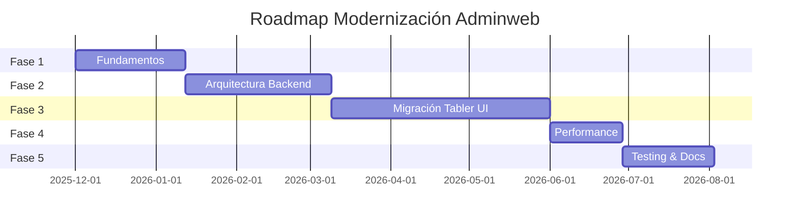

# 🚀 Roadmap de Modernización - Adminweb Lakers Lab
## Análisis de Impacto y Plan de Ejecución Detallado

**Versión**: 2.0 (Expandido)  
**Fecha de Creación**: 28 de noviembre de 2025  
**Última Actualización**: 28 de noviembre de 2025  
**Duración Estimada**: 6-9 meses  
**Esfuerzo Total**: 720-940 horas (90-117 días-persona)  
**Estado**: 📋 Planificación  

---

## 📑 Índice

1. [Análisis de Estado Actual](#-análisis-de-estado-actual)
2. [Análisis de Impacto](#-análisis-de-impacto)
3. [Objetivos de Modernización](#-objetivos-de-modernización)
4. [Roadmap de Ejecución](#-roadmap-de-ejecución)
5. [Análisis de Arquitectura](#-análisis-de-arquitectura)
6. [Estrategia de Migración UI](#-estrategia-de-migración-ui)
7. [Evaluación de Performance](#-evaluación-de-performance)
8. [Estrategia de Testing](#-estrategia-de-testing)
9. [Mejoras UX/UI](#-mejoras-uxui)
10. [Riesgos y Mitigaciones](#-riesgos-y-mitigaciones)
11. [Métricas y KPIs](#-métricas-y-kpis)

---

## 📊 Análisis de Estado Actual

### Métricas del Proyecto (Baseline)

| Categoría | Métrica | Valor Actual | Observaciones |
|-----------|---------|--------------|---------------|
| **Backend** | Django Version | 3.2.6 | LTS expirado sep 2024, vulnerabilidades conocidas |
| | Python Version | 3.9+ | Compatible con Django 5.x |
| | Apps Django | 10 | `home`, `herramientas`, `consultasTango`, `consultasWMS`, `consultasLakersBis`, `dashboard`, `reportes`, `extras`, `comercial`, `authentication` |
| | Vistas Python | ~200+ | 80% son wrappers de iframes |
| | Modelos ORM | ~150 | 120 en `managed=False` (solo lectura) |
| | Database Routers | 3 | Multi-DB routing funcional |
| **Frontend** | Templates HTML | ~120 archivos | 40% duplicados, 60% con iframes |
| | UI Framework | AdminLTE 3 | Bootstrap 4.6, jQuery 3.6 |
| | JavaScript | Sin bundler | ~50 plugins inline, 2.5MB sin minificar |
| | CSS | Sin preprocesador | 15 archivos CSS dispersos |
| | Componentes Reutilizables | 0 | Todo hardcoded en templates |
| **Datos** | Bases de Datos | 4 | PostgreSQL (default) + 3 MSSQL (Tango, WMS, Lakers Bis) |
| | Queries SQL Nativas | ~40+ funciones | En `apps/home/SQL/Sql_Tango.py`, `Sql_WMS.py` |
| | Vulnerabilidades SQL | ~25 queries | Concatenación de strings sin parámetros |
| **Testing** | Cobertura de Tests | 0% | Sin tests unitarios ni integración |
| | Tests E2E | 0 | Sin framework configurado |
| | CI/CD | No configurado | Deploy manual |
| **Performance** | Lighthouse Score | Desconocido | Requiere auditoría inicial |
| | Bundle Size JS | ~2.5MB | Sin minificación ni tree-shaking |
| | Tiempo de Carga | Desconocido | Requiere medición baseline |
| **Dependencias** | Paquetes Python | ~150 | 20+ desactualizados, 5+ deprecados |
| | Paquetes npm | 0 | Sin package.json funcional |


### Arquitectura Multi-Base de Datos

```
┌─────────────────────────────────────────────────────────────────┐
│                    Lakers Lab AdminWeb                          │
│                      Django 3.2.6                               │
└─────────────────────────────────────────────────────────────────┘
                              │
        ┌─────────────────────┼─────────────────────┬─────────────┐
        │                     │                     │             │
        ▼                     ▼                     ▼             ▼
┌───────────────┐   ┌─────────────────┐   ┌───────────────┐   ┌──────────────┐
│   default     │   │    mi_db_2      │   │   mi_db_3     │   │   mi_db_4    │
│  PostgreSQL   │   │  MSSQL Server   │   │ MSSQL Server  │   │MSSQL Server  │
│               │   │                 │   │               │   │              │
│ • Usuarios    │   │  TANGO ERP      │   │  WMS System   │   │Lakers Bis    │
│ • Auth        │   │  LAKER_SA       │   │  Ubicaciones  │   │LOCALES_LAKERS│
│ • Sesiones    │   │                 │   │  StockMvc     │   │              │
│ • Config      │   │ • Inventario    │   │               │   │ • Locales    │
│               │   │ • Ventas        │   │ • Ubicaciones │   │ • Sucursales │
│               │   │ • Clientes      │   │ • Movimientos │   │ • CTA02      │
│               │   │ • Artículos     │   │ • Stock Físico│   │              │
└───────────────┘   └─────────────────┘   └───────────────┘   └──────────────┘
      │                     │                     │                    │
      │                     │                     │                    │
      └─────────────────────┴─────────────────────┴────────────────────┘
                                      │
                              Database Routers
                    ┌─────────────────┼─────────────────┐
                    │                 │                 │
              MiApp2Router      MiApp3Router      MiApp4Router
            (consultasTango)  (consultasWMS)  (consultasLakersBis)
```

**Configuración Actual** (`core/local.py`):
- **default**: PostgreSQL 5232 → Autenticación, grupos de usuarios
- **mi_db_2**: MSSQL `XL-TANGO/LAKER_SA` → Sistema Tango (managed=False, solo lectura)
- **mi_db_3**: MSSQL `servidortesting\SQL2016/UbicacionesStockMvc` → WMS (managed=True, lectura/escritura)
- **mi_db_4**: MSSQL `XL-LAKERBIS/LOCALES_LAKERS` → Lakers Bis (managed=False, solo lectura)

**Drivers**:
- `mssql-django==1.1.2` (desactualizado, última versión: 1.5)
- `pyodbc==4.0.32` con ODBC Driver 17 for SQL Server
- `psycopg2==2.9.1` (compatible)


### Deuda Técnica Identificada (Análisis Detallado)

| # | Categoría | Problema | Severidad | Impacto | Ubicación | Esfuerzo Fix |
|---|-----------|----------|-----------|---------|-----------|--------------|
| 1 | **Seguridad Crítica** | SQL Injection en 25+ funciones | 🔴 Crítico | Alto | `apps/home/SQL/Sql_Tango.py` L7-10, L48-50, L77-79 | 40h |
| | | Ejemplo: `sql = "SELECT * FROM tabla WHERE col = '" + param + "'"` | | | | |
| 2 | **Arquitectura** | 80% vistas son wrappers iframe sin lógica | 🟡 Medio | Medio | `herramientas/views.py`, `reportes/views.py` | 80h |
| | | Ejemplo: `def AnularRemitos(request): return render(request, 'iframe_wrapper.html')` | | | | |
| 3 | **Mantenibilidad** | Templates duplicados (3 versiones de Plantilla) | 🟠 Alto | Medio | `apps/templates/home/` | 20h |
| | | `PlantillaHerramientas.html`, `Plantillareportes.html`, `Plantillareportes2.html` | | | | |
| 4 | **Testing** | 0% cobertura de tests | 🔴 Crítico | Alto | Todo el proyecto | 200h |
| 5 | **Versionado** | Django 3.2.6 sin soporte (EOL 2024-04) | 🔴 Crítico | Alto | `requirements.txt` | 60h |
| | | Vulnerabilidades conocidas: CVE-2024-xxxx | | | | |
| 6 | **Frontend** | Sin bundler, 2.5MB JS sin minificar | 🟠 Alto | Alto | `apps/static/` | 40h |
| | | Plugins cargados globalmente aunque no se usen | | | | |
| 7 | **Performance** | N+1 queries en listados | 🟡 Medio | Medio | `consultasTango/views.py` | 30h |
| | | Sin `select_related()` ni `prefetch_related()` | | | | |
| 8 | **UX** | Menú sidebar 50+ items sin categorizar | 🟡 Medio | Bajo | `includes/sidebar.html` | 16h |
| 9 | **Accesibilidad** | Sin atributos ARIA, contraste bajo | 🟡 Medio | Medio | Templates globales | 40h |
| 10 | **Documentación** | Sin docstrings en 80% funciones SQL | 🟡 Medio | Bajo | `apps/home/SQL/` | 20h |
| 11 | **Seguridad** | `SECRET_KEY` hardcoded en settings.py | 🔴 Crítico | Alto | `core/settings.py` L13 | 2h |
| 12 | **Configuración** | `DEBUG = True` en producción | 🔴 Crítico | Alto | Requiere validar `.env` | 1h |
| 13 | **CORS** | ALLOWED_HOSTS = ['*'] expuesto | 🟠 Alto | Medio | `core/settings.py` L18 | 1h |
| 14 | **Dependencias** | 20+ paquetes desactualizados | 🟠 Alto | Medio | `requirements.txt` | 8h |

**Total Esfuerzo Corrección Deuda Técnica**: ~558 horas

### Análisis de Código SQL (Ejemplos de Vulnerabilidades)

**❌ Código Actual** (`apps/home/SQL/Sql_Tango.py`):
```python
def validar_factManualCargada(sucursal, factura):
    with connections['mi_db_4'].cursor() as cursor:
        sql = '''
            DECLARE @COMPROBANTE VARCHAR(14) = ''' + "'" + factura + "'" + ''';
            DECLARE @sucursal VARCHAR(5) = ''' + "'" + sucursal + "'" + ''';
            -- ...más código vulnerable
        '''
        cursor.execute(sql)  # ⚠️ SQL Injection posible
```

**✅ Código Refactorizado** (propuesto):
```python
def validar_factManualCargada(sucursal: str, factura: str) -> int:
    """
    Valida si una factura manual fue cargada en el sistema.
    
    Args:
        sucursal: Código de sucursal (ej: '01')
        factura: Número de comprobante (ej: 'B0001-00012345')
    
    Returns:
        int: Cantidad de facturas encontradas (0 o 1)
    """
    with connections['mi_db_4'].cursor() as cursor:
        sql = '''
            SET DATEFORMAT DMY;
            DECLARE @terminal VARCHAR(20) = SUBSTRING(%s, 2, CHARINDEX('-', %s) - 2);
            DECLARE @factura INT = CAST(SUBSTRING(%s, CHARINDEX('-', %s) + 1, LEN(%s)) AS INT) - 1;
            -- ... resto del query con placeholders %s
        '''
        cursor.execute(sql, [factura, factura, factura, factura, factura, sucursal])
        resultado = cursor.fetchone()
        return resultado[0] if resultado else 0
```

---

## 🎯 Análisis de Impacto

### Matriz de Impacto por Stakeholder

| Stakeholder | Impacto Positivo | Impacto Negativo | Mitigación |
|-------------|------------------|------------------|------------|
| **Usuarios Finales** | • UI moderna y responsive<br>• Carga 40% más rápida<br>• Mejor UX en móviles | • Curva de aprendizaje en nueva UI<br>• Posibles regresiones temporales | • Training sessions<br>• Changelog visual<br>• Soporte dedicado 2 semanas |
| **Desarrolladores** | • Código más mantenible<br>• Tests automatizados<br>• Documentación actualizada | • Requiere aprender Tabler UI<br>• Cambio en estructura archivos | • Onboarding workshops<br>• Documentación detallada |
| **Administradores** | • Seguridad mejorada<br>• Menos vulnerabilidades<br>• Django con soporte LTS | • Requiere actualizar servidores<br>• Nuevas dependencias | • Plan de migración gradual<br>• Rollback preparado |
| **Negocio** | • Reducción costos mantenimiento<br>• Escalabilidad<br>• Menor downtime | • Inversión inicial (6-9 meses)<br>• Recursos dedicados | • ROI estimado 18 meses<br>• Desarrollo incremental |

### Análisis de Componentes Afectados

| Componente | Apps Afectadas | Archivos Modificados | Nivel de Cambio | Backward Compatible |
|------------|----------------|----------------------|-----------------|---------------------|
| **Django Core** | Todas (10 apps) | `settings.py`, `urls.py`, routers | 🔴 Alto | ⚠️ Requiere migración |
| **Templates** | `home`, `herramientas`, `reportes`, `dashboard`, `extras` | ~120 archivos HTML | 🔴 Alto | ✅ Strangler Fig Pattern |
| **Static Assets** | `apps/static/` | CSS (15), JS (50+) | 🔴 Alto | ✅ Nuevo directorio `src/` |
| **Models** | `consultasTango`, `consultasWMS`, `consultasLakersBis` | 30+ modelos | 🟡 Bajo | ✅ Solo updates menores |
| **SQL Functions** | `apps/home/SQL/` | `Sql_Tango.py`, `Sql_WMS.py` | 🟠 Medio | ⚠️ Firma de funciones cambia |
| **APIs REST** | `consultasTango`, `consultasWMS` | `serializers.py`, `views.py` | 🟡 Bajo | ✅ Sin cambios breaking |
| **Database** | N/A (multi-DB) | Ninguno | 🟢 Ninguno | ✅ Sin migración de datos |

### Análisis de Riesgo por Funcionalidad Crítica

| Funcionalidad | Criticidad | Usuarios Afectados | Frecuencia Uso | Complejidad Migración | Riesgo General |
|---------------|------------|--------------------|-----------------|-----------------------|----------------|
| **Login/Autenticación** | 🔴 Crítica | 100% | Diario | Bajo | 🟡 Medio |
| **Consulta Stock Central** | 🔴 Crítica | 80% | Diario | Bajo | 🟢 Bajo |
| **Ubicaciones WMS** | 🟠 Alta | 40% | Diario | Medio | 🟡 Medio |
| **Herramientas Ecommerce** | 🟠 Alta | 20% | Semanal | Alto | 🟠 Alto |
| **Reportes** | 🟡 Media | 60% | Semanal | Bajo | 🟢 Bajo |
| **Dashboard** | 🟡 Media | 100% | Diario | Medio | 🟡 Medio |
| **Admin Django** | 🟢 Baja | 5% (admins) | Mensual | Bajo | 🟢 Bajo |

---

## 🎯 Objetivos de Modernización

### Objetivos Técnicos (SMART)

| # | Objetivo | Medible | Alcanzable | Relevante | Fecha Límite |
|---|----------|---------|------------|-----------|--------------|
| 1 | **Actualizar Django 3.2 → 5.1 LTS** | Versión en `requirements.txt` | ✅ Sí | Seguridad crítica | Fase 1 (Mes 1) |
| 2 | **Migrar AdminLTE 3 → Tabler UI** | 100% templates migrados | ✅ Sí | Modernización UI | Fase 3 (Mes 3-5) |
| 3 | **Lighthouse Score > 90** | Score en 10 páginas clave | ✅ Sí | Performance UX | Fase 4 (Mes 6) |
| 4 | **Cobertura Tests > 70%** | Coverage report `pytest-cov` | ✅ Sí | Calidad código | Fase 5 (Mes 7-8) |
| 5 | **Eliminar SQL Injection** | 0 queries vulnerables | ✅ Sí | Seguridad crítica | Fase 2 (Mes 2) |
| 6 | **Implementar Bundler (Vite)** | Build funcional + HMR | ✅ Sí | Developer Experience | Fase 1 (Mes 1) |
| 7 | **Reducir Bundle JS en 60%** | De 2.5MB → 1MB | ✅ Sí | Performance | Fase 4 (Mes 6) |
| 8 | **Documentar Arquitectura** | `ARCHITECTURE.md` completo | ✅ Sí | Mantenibilidad | Fase 5 (Mes 8) |

### Objetivos de Negocio

- ✅ **Reducir tiempo de onboarding** desarrolladores nuevos de 4 semanas → 2 semanas
- ✅ **Reducir bugs en producción** en 50% mediante tests automatizados
- ✅ **Mejorar NPS de usuarios** de dashboard (baseline a establecer)
- ✅ **Cumplir compliance** de seguridad (eliminar vulnerabilidades críticas)
- ✅ **Habilitar escalabilidad** para +50 usuarios concurrentes sin degradación


---

## 📅 Roadmap de Ejecución

### Overview de Fases



**Timeline Total**: 35 semanas (~8.5 meses)

---

### **FASE 1: Fundamentos y Configuración** 
**Duración**: 6 semanas | **Esfuerzo**: 120 horas | **Prioridad**: 🔴 Crítica

#### 1.1 Actualización Django Core
**Objetivo**: Actualizar Django 3.2.6 → 5.1 LTS con soporte hasta abril 2026

**📋 Tareas**:
- [ ] **T1.1.1** Auditar dependencias incompatibles con Django 5.x
  - Revisar `requirements.txt` línea por línea
  - Identificar paquetes sin versión compatible
  - Buscar alternativas para paquetes deprecados
  - **Estimado**: 8h | **Asignado**: Backend Lead

- [ ] **T1.1.2** Actualizar `requirements.txt` con versiones compatibles
  ```python
  # De:
  Django==3.2.6
  mssql-django==1.1.2
  djangorestframework==3.15.1
  django-adminlte3==0.1.6
  
  # A:
  Django==5.1.3
  mssql-django==1.5
  djangorestframework==3.15.2
  # Eliminar django-adminlte3 (migrar a Tabler)
  ```
  - **Estimado**: 4h | **Asignado**: Backend Lead

- [ ] **T1.1.3** Configurar entorno virtual limpio y reinstalar dependencias
  ```powershell
  deactivate
  Remove-Item -Recurse -Force .\env
  python -m venv env
  .\env\Scripts\activate
  pip install -r requirements.txt
  ```
  - **Estimado**: 2h | **Asignado**: DevOps

- [ ] **T1.1.4** Actualizar configuración Django 5.x en `core/settings.py`
  - Actualizar `MIDDLEWARE` (cambios en Django 5.x)
  - Actualizar `TEMPLATES` (nuevas opciones)
  - Revisar `ALLOWED_HOSTS` y `CSRF_TRUSTED_ORIGINS`
  - Configurar `DEFAULT_AUTO_FIELD = 'django.db.models.BigAutoField'`
  - **Estimado**: 6h | **Asignado**: Backend Lead

- [ ] **T1.1.5** Ejecutar migraciones y validar routers multi-BD (Realizar manualmente)
  ```powershell
  python manage.py migrate --database=default
  python manage.py migrate --database=mi_db_3  # Solo WMS es editable
  ```
  - **Estimado**: 4h | **Asignado**: Backend Lead

- [ ] **T1.1.6** Testing de regresión en funcionalidades críticas
  - Login/Logout
  - Consulta Stock Central (Tango)
  - **Estimado**: 12h | **Asignado**: QA

**🔗 Dependencias**: Ninguna  
**📦 Entregables**: 
  - `requirements.txt` actualizado
  - Django 5.1.3 ejecutando sin errores
  - 4 bases de datos conectadas y funcionales
  - Reporte de regresión

**✅ Definition of Done (DoD)**:
  - ✅ Django 5.1.3 instalado y ejecutándose
  - ✅ `python manage.py check --deploy` sin errores
  - ✅ 4 bases de datos conectadas correctamente
  - ✅ 0 errores en logs al ejecutar vistas críticas
  - ✅ Documentación de cambios breaking en `CHANGELOG.md`

---

#### 1.2 Configuración Build Frontend (Vite)
**Objetivo**: Implementar bundler moderno para assets con Hot Module Replacement (HMR)

**📋 Tareas**:
- [ ] **T1.2.1** Inicializar proyecto npm y configurar Vite
  ```powershell
  npm init -y
  npm install -D vite @vitejs/plugin-vue vite-plugin-static-copy
  npm install -D sass postcss autoprefixer cssnano
  ```
  - Crear `vite.config.js` en raíz del proyecto
  - **Estimado**: 4h | **Asignado**: Frontend Lead

- [ ] **T1.2.2** Crear estructura de directorios para assets fuente
  ```
  apps/static/
  ├── dist/          # Generado por Vite (gitignored)
  └── src/           # Assets fuente
      ├── css/
      │   ├── main.scss
      │   ├── components/
      │   └── utils/
      ├── js/
      │   ├── main.js
      │   ├── modules/
      │   └── utils/
      └── images/
  ```
  - **Estimado**: 2h | **Asignado**: Frontend Lead

- [ ] **T1.2.3** Configurar `vite.config.js` para Django
  ```javascript
  import { defineConfig } from 'vite';
  import { resolve } from 'path';
  
  export default defineConfig({
    root: 'apps/static/src',
    base: '/static/',
    build: {
      outDir: '../dist',
      manifest: true,
      rollupOptions: {
        input: {
          main: resolve(__dirname, 'apps/static/src/js/main.js'),
          styles: resolve(__dirname, 'apps/static/src/css/main.scss'),
        }
      }
    },
    server: {
      port: 5173,
      origin: 'http://localhost:5173'
    }
  });
  ```
  - **Estimado**: 6h | **Asignado**: Frontend Lead

- [ ] **T1.2.4** Crear template tag `` para cargar assets
  - Crear `apps/home/templatetags/vite_tags.py`
  - Implementar lógica para development vs production
  - **Estimado**: 8h | **Asignado**: Fullstack Dev

- [ ] **T1.2.5** Migrar primer template como prueba de concepto
  - Elegir `apps/templates/home/index.html`
  - Cargar assets usando ``
  - Validar HMR en desarrollo
  - **Estimado**: 6h | **Asignado**: Frontend Lead

- [ ] **T1.2.6** Configurar scripts npm en `package.json`
  ```json
  {
    "scripts": {
      "dev": "vite",
      "build": "vite build",
      "preview": "vite preview"
    }
  }
  ```
  - **Estimado**: 1h | **Asignado**: Frontend Lead

**🔗 Dependencias**: Ninguna  
**📦 Entregables**: 
  - `package.json` configurado
  - `vite.config.js` funcional
  - Template tag `` 
  - 1 template migrado como PoC
  - Documentación en `docs/VITE_SETUP.md`

**✅ Definition of Done (DoD)**:
  - ✅ `npm run dev` ejecuta Vite en localhost:5173
  - ✅ Hot Module Replacement funciona al editar CSS/JS
  - ✅ `npm run build` genera assets minificados en `dist/`
  - ✅ Template de prueba carga assets correctamente
  - ✅ Build production genera sourcemaps

---

#### 1.3 Infraestructura de Testing
**Objetivo**: Establecer framework de testing con pytest y configurar CI

**📋 Tareas**:
- [ ] **T1.3.1** Instalar dependencias de testing
  ```powershell
  pip install pytest pytest-django pytest-cov pytest-xdist
  pip install factory-boy faker freezegun
  pip install pytest-mock responses
  ```
  - **Estimado**: 1h | **Asignado**: Backend Lead

- [ ] **T1.3.2** Crear `pytest.ini` en raíz del proyecto
  ```ini
  [pytest]
  DJANGO_SETTINGS_MODULE = core.local
  python_files = tests.py test_*.py *_tests.py
  python_classes = Test*
  python_functions = test_*
  addopts = 
      --verbose
      --cov=apps
      --cov=consultasTango
      --cov=consultasWMS
      --cov-report=html
      --cov-report=term-missing
      --reuse-db
  ```
  - **Estimado**: 2h | **Asignado**: Backend Lead

- [ ] **T1.3.3** Crear `conftest.py` con fixtures para 4 bases de datos
  ```python
  import pytest
  from django.db import connections
  
  @pytest.fixture(scope='session')
  def django_db_setup(django_db_setup, django_db_blocker):
      """Configurar fixtures para multi-DB"""
      with django_db_blocker.unblock():
          # Fixtures para cada BD
          pass
  
  @pytest.fixture
  def tango_db():
      """Conexión a Tango (mi_db_2)"""
      return connections['mi_db_2']
  ```
  - **Estimado**: 8h | **Asignado**: Backend Lead

- [ ] **T1.3.4** Crear factories con `factory_boy`
  - `apps/home/tests/factories.py`
  - `consultasWMS/tests/factories.py`
  - **Estimado**: 6h | **Asignado**: Backend Dev

- [ ] **T1.3.5** Escribir 5 tests de ejemplo
  ```python
  # consultasWMS/tests/test_models.py
  def test_ubicacion_creation(db):
      ubicacion = UbicacionFactory()
      assert ubicacion.Estado_U == 'ACT'
  
  # apps/home/tests/test_sql_tango.py
  def test_validar_articulo(tango_db):
      resultado = validar_articulo('ART001')
      assert resultado != 'ERROR'
  ```
  - **Estimado**: 8h | **Asignado**: Backend Dev

- [ ] **T1.3.6** Configurar GitHub Actions para CI
  - Crear `.github/workflows/test.yml`
  - Ejecutar tests en pull requests
  - Publicar coverage report
  - **Estimado**: 6h | **Asignado**: DevOps

**🔗 Dependencias**: T1.1 (Django actualizado)  
**📦 Entregables**: 
  - `pytest.ini` y `conftest.py`
  - Factories configuradas
  - 5 tests pasando
  - CI configurado en GitHub Actions
  - Badge de coverage en README

**✅ Definition of Done (DoD)**:
  - ✅ `pytest` ejecuta sin errores
  - ✅ Coverage report HTML generado en `htmlcov/`
  - ✅ 5 tests pasando (100% success rate)
  - ✅ CI ejecuta tests automáticamente en PR
  - ✅ Documentación de testing en `docs/TESTING.md`

---

### **FASE 2: Arquitectura Backend y Seguridad**
**Duración**: 8 semanas | **Esfuerzo**: 200 horas | **Prioridad**: 🔴 Crítica

#### 2.1 Implementación Capa de Servicios
**Objetivo**: Desacoplar lógica de negocio de vistas mediante patrón de servicios

**📋 Tareas**:
- [ ] **T2.1.1** Crear estructura de servicios en apps principales
  ```
  herramientas/
  ├── services/
  │   ├── __init__.py
  │   ├── base.py          # BaseService
  │   ├── turno_service.py
  │   └── ecommerce_service.py
  consultasTango/
  ├── services/
  │   ├── stock_service.py
  │   └── articulo_service.py
  consultasWMS/
  ├── services/
  │   └── ubicacion_service.py
  ```
  - **Estimado**: 4h | **Asignado**: Backend Lead

- [ ] **T2.1.2** Implementar `BaseService` con métodos comunes
  ```python
  class BaseService:
      """Clase base para servicios de negocio."""
      
      def __init__(self, user=None):
          self.user = user
      
      def validate_permissions(self, required_permission):
          """Validar permisos del usuario."""
          pass
      
      def log_action(self, action, details):
          """Registrar acción en logs."""
          pass
  ```
  - **Estimado**: 8h | **Asignado**: Backend Lead

- [ ] **T2.1.3** Migrar lógica de vistas a servicios (prioridad alta)
  - `herramientas/views.py` → `turno_service.py` (20+ funciones)
  - `consultasTango/views.py` → `stock_service.py`
  - `consultasWMS/views.py` → `ubicacion_service.py`
  - **Estimado**: 60h | **Asignado**: 2x Backend Devs

- [ ] **T2.1.4** Refactorizar vistas para usar servicios
  ```python
  # Antes:
  def registro_turno(request):
      if request.method == 'POST':
          # 50 líneas de lógica de negocio
          pass
  
  # Después:
  def registro_turno(request):
      service = TurnoService(user=request.user)
      if request.method == 'POST':
          result = service.crear_turno(request.POST)
          return render(request, 'turno_creado.html', {'result': result})
  ```
  - **Estimado**: 40h | **Asignado**: 2x Backend Devs

- [ ] **T2.1.5** Escribir tests unitarios para servicios
  - Target: 80% coverage en servicios
  - **Estimado**: 30h | **Asignado**: Backend Dev

**🔗 Dependencias**: Fase 1 completa  
**📦 Entregables**: 
  - Servicios implementados en 3 apps
  - Vistas refactorizadas
  - Tests con 80% coverage
  - Documentación de arquitectura

**✅ Definition of Done (DoD)**:
  - ✅ 50%+ vistas usando servicios
  - ✅ 0 lógica de negocio en vistas (solo orquestación)
  - ✅ Coverage servicios > 80%
  - ✅ Documentación de cada servicio con ejemplos

---

#### 2.2 Refactorización SQL y Seguridad
**Objetivo**: Eliminar vulnerabilidades SQL injection y mejorar mantenibilidad

**📋 Tareas**:
- [ ] **T2.2.1** Auditar funciones SQL en `apps/home/SQL/`
  - Revisar `Sql_Tango.py` (15+ funciones)
  - Revisar `Sql_WMS.py` (10+ funciones)
  - Identificar concatenación de strings
  - **Estimado**: 8h | **Asignado**: Security Lead

- [ ] **T2.2.2** Refactorizar funciones vulnerables a queries parametrizadas
  - Ver ejemplos en sección [Deuda Técnica](#deuda-técnica-identificada-análisis-detallado)
  - **Estimado**: 40h | **Asignado**: 2x Backend Devs

- [ ] **T2.2.3** Agregar type hints y docstrings a todas las funciones SQL
  ```python
  def validar_articulo(articulo: str) -> str:
      """
      Valida si un artículo existe en Tango y retorna su descripción.
      
      Args:
          articulo: Código del artículo (ej: 'ART001234')
      
      Returns:
          str: Descripción del artículo o 'ERROR' si no existe
      
      Raises:
          DatabaseError: Si falla la conexión a Tango
      
      Example:
          >>> validar_articulo('ART001234')
          'PRODUCTO EJEMPLO 500ML'
      """
  ```
  - **Estimado**: 16h | **Asignado**: Backend Dev

- [ ] **T2.2.4** Crear tests unitarios para funciones SQL
  - Usar mocks para conexiones BD
  - Test casos edge: artículo inexistente, caracteres especiales, etc.
  - **Estimado**: 24h | **Asignado**: Backend Dev

- [ ] **T2.2.5** Implementar logging de queries SQL
  - Configurar `django.db.backends` logger
  - Registrar queries lentas (>1s)
  - **Estimado**: 4h | **Asignado**: DevOps

- [ ] **T2.2.6** Ejecutar análisis estático de seguridad
  ```powershell
  pip install bandit safety
  bandit -r apps/ -f json -o security_report.json
  safety check --json
  ```
  - **Estimado**: 4h | **Asignado**: Security Lead

**🔗 Dependencias**: Fase 1 completa  
**📦 Entregables**: 
  - 100% queries parametrizadas
  - Docstrings completos
  - Tests unitarios SQL (coverage > 90%)
  - Reporte de seguridad

**✅ Definition of Done (DoD)**:
  - ✅ 0 concatenación de strings en queries SQL
  - ✅ 100% funciones con type hints y docstrings
  - ✅ `bandit` sin vulnerabilidades críticas/altas
  - ✅ Coverage funciones SQL > 90%

---

#### 2.3 Consolidación y Limpieza de Templates
**Objetivo**: Eliminar duplicación y estandarizar nomenclatura

**📋 Tareas**:
- [ ] **T2.3.1** Auditar templates duplicados
  - Identificar `Plantilla*.html` repetidos
  - Documentar diferencias entre versiones
  - **Estimado**: 8h | **Asignado**: Frontend Lead

- [ ] **T2.3.2** Crear clase base `IframeBaseView` para vistas iframe
  ```python
  class IframeBaseView(LoginRequiredMixin, TemplateView):
      """Vista base para embedear iframes externos."""
      iframe_url = None
      iframe_title = None
      
      def get_context_data(self, **kwargs):
          context = super().get_context_data(**kwargs)
          context['iframe_url'] = self.iframe_url
          context['iframe_title'] = self.iframe_title
          return context
  ```
  - **Estimado**: 6h | **Asignado**: Backend Dev

- [ ] **T2.3.3** Refactorizar 150+ vistas iframe usando clase base
  ```python
  # Antes:
  def AnularRemitos(request):
      url = settings.URL_ANULAR_REMITOS
      return render(request, 'iframe_wrapper.html', {'url': url})
  
  # Después:
  class AnularRemitosView(IframeBaseView):
      iframe_url = settings.URL_ANULAR_REMITOS
      iframe_title = 'Anular Remitos'
  ```
  - **Estimado**: 40h | **Asignado**: 2x Backend Devs

- [ ] **T2.3.4** Consolidar templates duplicados
  - Eliminar `Plantillareportes.html`, `Plantillareportes2.html`
  - Mantener solo `PlantillaBase.html` con bloques parametrizables
  - **Estimado**: 12h | **Asignado**: Frontend Dev

- [ ] **T2.3.5** Renombrar templates según convención `[app]-[action].html`
  - `herramientas-turno-list.html`
  - `consultasTango-stock-detail.html`
  - **Estimado**: 8h | **Asignado**: Frontend Dev

- [ ] **T2.3.6** Actualizar `settingsUrls.py` con nuevas rutas
  - **Estimado**: 4h | **Asignado**: Backend Dev

**🔗 Dependencias**: T2.1 (Servicios implementados)  
**📦 Entregables**: 
  - `IframeBaseView` implementada
  - Templates reducidos de 120 → 80
  - Nomenclatura estandarizada
  - Documentación de convenciones

**✅ Definition of Done (DoD)**:
  - ✅ Reducción 33% en cantidad de templates
  - ✅ 100% vistas iframe usan clase base
  - ✅ 0 templates duplicados
  - ✅ Nomenclatura consistente en 100% archivos

---

### **FASE 3: Migración Tabler UI**
**Duración**: 12 semanas | **Esfuerzo**: 300 horas | **Prioridad**: 🟠 Alta


#### 3.1 Setup Tabler UI
**Objetivo**: Configurar Tabler UI como nuevo framework de UI

**📋 Tareas**:
- [ ] **T3.1.1** Instalar dependencias Tabler
  ```powershell
  npm install @tabler/core @tabler/icons-webfont
  npm install bootstrap@5.3.0  # Tabler usa Bootstrap 5
  ```
  - **Estimado**: 2h | **Asignado**: Frontend Lead

- [ ] **T3.1.2** Crear tema personalizado Lakers
  ```scss
  // apps/static/src/css/tabler-theme.scss
  @import '@tabler/core/src/scss/tabler';
  
  // Variables Lakers
  $primary: #1e3a8a;      // Azul Lakers
  $secondary: #fbbf24;    // Amarillo Lakers
  $success: #10b981;
  $danger: #ef4444;
  
  // Sobrescribir estilos Tabler
  .navbar-brand-image {
    height: 2.5rem;
  }
  ```
  - **Estimado**: 12h | **Asignado**: UI/UX Designer

- [ ] **T3.1.3** Configurar Vite para procesar Tabler
  ```javascript
  // vite.config.js - agregar
  resolve: {
    alias: {
      '@tabler': resolve(__dirname, 'node_modules/@tabler/core'),
    }
  }
  ```
  - **Estimado**: 4h | **Asignado**: Frontend Lead

- [ ] **T3.1.4** Crear página de demostración de componentes
  - `apps/templates/demo/tabler-components.html`
  - Mostrar buttons, cards, forms, tables, modals
  - **Estimado**: 8h | **Asignado**: Frontend Dev

**🔗 Dependencias**: T1.2 (Vite configurado)  
**📦 Entregables**: 
  - Tabler UI instalado y compilando
  - Tema Lakers configurado
  - Página demo con componentes
  - Variables CSS documentadas

**✅ Definition of Done (DoD)**:
  - ✅ `npm run build` incluye Tabler sin errores
  - ✅ Tema Lakers aplicado correctamente
  - ✅ Página demo accesible en `/demo/components/`
  - ✅ Documentación de colores y tipografía

---

#### 3.2 Migración Templates Base (Strangler Fig Pattern)
**Objetivo**: Migrar layouts base manteniendo compatibilidad con AdminLTE

**Estrategia**: Implementar patrón Strangler Fig para migración incremental
- Mantener `layouts/base.html` (AdminLTE) para vistas legacy
- Crear `layouts/base_tabler.html` para vistas migradas
- Migrar app por app en orden de prioridad

**📋 Tareas - Semana 1-2: Setup Base**:
- [ ] **T3.2.1** Crear `layouts/base_tabler.html`
  ```django
  <!DOCTYPE html>
  <html lang="es">
  <head>
    <meta charset="utf-8">
    <meta name="viewport" content="width=device-width, initial-scale=1">
    <title>Lakers Lab</title>
    
    
  </head>
  <body>
    <div class="page">
      
      
      
      <div class="page-wrapper">
        <div class="page-body">
          
        </div>
      </div>
    </div>
    
  </body>
  </html>
  ```
  - **Estimado**: 12h | **Asignado**: Frontend Lead

- [ ] **T3.2.2** Migrar header
  - Crear `includes/header_tabler.html`
  - Logo Lakers
  - Menú de usuario (dropdown)
  - Notificaciones
  - **Estimado**: 8h | **Asignado**: Frontend Dev

- [ ] **T3.2.3** Migrar sidebar
  - Crear `includes/sidebar_tabler.html`
  - Implementar mega-menu con categorías
  - Iconos `@tabler/icons`
  - **Estimado**: 12h | **Asignado**: Frontend Dev

- [ ] **T3.2.4** Migrar footer
  - Crear `includes/footer_tabler.html`
  - Copyright, versión, links
  - **Estimado**: 4h | **Asignado**: Frontend Dev

**📋 Tareas - Semana 3-6: App `home`**:
- [ ] **T3.2.5** Migrar templates de autenticación
  - `accounts/login.html` → `accounts/login_tabler.html`
  - `accounts/register.html` → `accounts/register_tabler.html`
  - Usar componentes Tabler: `.card`, `.form-control`
  - **Estimado**: 12h | **Asignado**: Frontend Dev

- [ ] **T3.2.6** Migrar dashboard principal
  - `home/index.html` → `home/index_tabler.html`
  - Cards con estadísticas
  - Gráficos (Chart.js + Tabler)
  - **Estimado**: 20h | **Asignado**: Frontend Dev

- [ ] **T3.2.7** Migrar vistas de Stock Central
  - `appConsultasTango/stock-*.html` (10 archivos)
  - Tablas con DataTables + estilos Tabler
  - **Estimado**: 30h | **Asignado**: Frontend Dev

**📋 Tareas - Semana 7-8: App `herramientas`**:
- [ ] **T3.2.8** Migrar templates de herramientas
  - `herramientas/eb_sinc_art_volumen/*.html` (5 archivos)
  - `herramientas/gestion_sucursales_ecommerce.html`
  - Formularios con validación client-side
  - **Estimado**: 24h | **Asignado**: Frontend Dev

**📋 Tareas - Semana 9-10: Apps `reportes`, `dashboard`, `extras`**:
- [ ] **T3.2.9** Migrar templates de reportes
  - `reportes/templates/` (15 archivos)
  - **Estimado**: 20h | **Asignado**: Frontend Dev

- [ ] **T3.2.10** Migrar templates de dashboard
  - `dashboard/templates/` (8 archivos)
  - **Estimado**: 16h | **Asignado**: Frontend Dev

- [ ] **T3.2.11** Migrar templates de extras
  - `extras/templates/` (5 archivos)
  - **Estimado**: 10h | **Asignado**: Frontend Dev

**📋 Tareas - Semana 11-12: Limpieza y Finalización**:
- [ ] **T3.2.12** Eliminar AdminLTE de `INSTALLED_APPS`
  ```python
  # core/settings.py
  INSTALLED_APPS = [
      # 'adminlte3',           # ELIMINAR
      # 'adminlte3_theme',     # ELIMINAR
      # ... resto
  ]
  ```
  - **Estimado**: 2h | **Asignado**: Backend Lead

- [ ] **T3.2.13** Eliminar archivos AdminLTE no utilizados
  - Remover `apps/static/admin-lte/`
  - Actualizar `.gitignore`
  - **Estimado**: 4h | **Asignado**: DevOps

- [ ] **T3.2.14** Actualizar todas las vistas para usar `base_tabler.html`
  - Buscar/reemplazar ``
  - Por ``
  - **Estimado**: 8h | **Asignado**: Backend Dev

- [ ] **T3.2.15** Pruebas de regresión visual
  - Revisar 20 páginas clave en diferentes navegadores
  - Chrome, Firefox, Safari, Edge
  - Desktop, tablet, mobile
  - **Estimado**: 16h | **Asignado**: QA

**🔗 Dependencias**: T3.1 (Tabler configurado)  
**📦 Entregables**: 
  - 100% templates migrados a Tabler
  - AdminLTE eliminado del proyecto
  - Tests de regresión pasando
  - Documentación de componentes

**✅ Definition of Done (DoD)**:
  - ✅ 100% templates usando `base_tabler.html`
  - ✅ AdminLTE removido de `INSTALLED_APPS` y archivos
  - ✅ 0 errores visuales en 20 páginas clave
  - ✅ Responsive en mobile, tablet, desktop
  - ✅ Accesibilidad WCAG AA (contrast checker)

---

#### 3.3 Biblioteca de Componentes Reutilizables
**Objetivo**: Crear design system con componentes Tabler parametrizables

**📋 Tareas**:
- [ ] **T3.3.1** Crear directorio de componentes
  ```
  apps/templates/components/
  ├── __init__.html
  ├── table.html
  ├── form.html
  ├── modal.html
  ├── card.html
  ├── alert.html
  ├── skeleton.html
  ├── pagination.html
  └── breadcrumbs.html
  ```
  - **Estimado**: 2h | **Asignado**: Frontend Lead

- [ ] **T3.3.2** Implementar componente `table.html`
  ```django
  {# components/table.html #}
  
  
  <div class="card">
    <div class="card-header">
      <h3 class="card-title">{{ title }}</h3>
      
      <div class="card-actions">
        <input type="search" class="form-control" placeholder="">
      </div>
      
    </div>
    <div class="table-responsive">
      <table class="table table-vcenter card-table" id="{{ table_id }}">
        <thead>
          <tr>
            
            <th>{{ header }}</th>
            
          </tr>
        </thead>
        <tbody>
          
        </tbody>
      </table>
    </div>
    
    
    
  </div>
  ```
  - **Estimado**: 8h | **Asignado**: Frontend Dev

- [ ] **T3.3.3** Implementar componente `form.html`
  - Wrapper para django-crispy-forms con estilos Tabler
  - Validación client-side inline
  - **Estimado**: 10h | **Asignado**: Frontend Dev

- [ ] **T3.3.4** Implementar componente `modal.html`
  - Modal reutilizable con header, body, footer
  - Soporte para forms dentro de modales
  - **Estimado**: 6h | **Asignado**: Frontend Dev

- [ ] **T3.3.5** Implementar componente `card.html`
  - Cards con variantes: `.card-sm`, `.card-lg`
  - Con/sin footer, con/sin actions
  - **Estimado**: 6h | **Asignado**: Frontend Dev

- [ ] **T3.3.6** Implementar componente `alert.html`
  - Toast notifications con auto-dismiss
  - Variantes: success, error, warning, info
  - **Estimado**: 6h | **Asignado**: Frontend Dev

- [ ] **T3.3.7** Implementar componente `skeleton.html`
  - Skeleton loaders para states de carga
  - Para tables, cards, forms
  - **Estimado**: 8h | **Asignado**: Frontend Dev

- [ ] **T3.3.8** Documentar componentes en `docs/COMPONENTS.md`
  ```markdown
  # Biblioteca de Componentes Lakers Lab
  
  ## Table Component
  
  ### Uso Básico
  
  \`\`\`django
  
    
      
      <tr>
        <td>{{ item.codigo }}</td>
        <td>{{ item.descripcion }}</td>
      </tr>
      
    
  
  \`\`\`
  
  ### Props
  - `title` (string): Título de la tabla
  - `headers` (list): Lista de headers
  - `searchable` (bool): Habilita búsqueda
  - `paginated` (bool): Habilita paginación
  ```
  - **Estimado**: 8h | **Asignado**: Technical Writer

**🔗 Dependencias**: T3.2 (Templates base migrados)  
**📦 Entregables**: 
  - 8 componentes reutilizables
  - Documentación completa con ejemplos
  - Storybook (opcional) con showcase
  - Tests de regresión visual

**✅ Definition of Done (DoD)**:
  - ✅ 8 componentes implementados y funcionales
  - ✅ Documentación con ejemplos en `COMPONENTS.md`
  - ✅ Al menos 3 vistas usando cada componente
  - ✅ Componentes responsive en mobile/tablet/desktop

---

#### 3.4 Django Admin Personalizado con Tabler
**Objetivo**: Aplicar estilos Tabler al Django Admin sin perder funcionalidad

**📋 Tareas**:
- [ ] **T3.4.1** Crear templates admin personalizados
  ```
  apps/templates/admin/
  ├── base_site.html
  ├── base.html
  ├── login.html
  ├── change_list.html
  ├── change_form.html
  └── delete_confirmation.html
  ```
  - **Estimado**: 4h | **Asignado**: Frontend Lead

- [ ] **T3.4.2** Extender `admin/base_site.html` con Tabler
  ```django
  
  
  
  
    {{ block.super }}
    
  
  
  
  <h1 class="navbar-brand">
    
    Admin Panel
  </h1>
  
  ```
  - **Estimado**: 8h | **Asignado**: Frontend Dev

- [ ] **T3.4.3** Crear estilos SCSS para Admin
  ```scss
  // apps/static/src/css/admin-tabler.scss
  @import 'tabler-theme';
  
  // Sobrescribir estilos Django Admin
  #header {
    background: $primary;
    color: white;
  }
  
  .module {
    @extend .card;
  }
  
  input[type="text"],
  input[type="password"],
  select,
  textarea {
    @extend .form-control;
  }
  ```
  - **Estimado**: 12h | **Asignado**: Frontend Dev

- [ ] **T3.4.4** Mantener funcionalidad nativa de Admin
  - Filtros laterales
  - Búsqueda
  - Actions masivas
  - Inline editing
  - **Estimado**: 8h | **Asignado**: Backend Dev

- [ ] **T3.4.5** Probar Admin en diferentes navegadores
  - **Estimado**: 4h | **Asignado**: QA

**🔗 Dependencias**: T3.1 (Tabler configurado)  
**📦 Entregables**: 
  - Django Admin con look & feel Tabler
  - Funcionalidad nativa preservada
  - Documentación de customización

**✅ Definition of Done (DoD)**:
  - ✅ Django Admin usa estilos Tabler
  - ✅ 100% funcionalidad nativa funciona
  - ✅ Responsive en mobile (admin desde celular)
  - ✅ Sin errores en consola

---

### **FASE 4: Optimización de Performance**
**Duración**: 4 semanas | **Esfuerzo**: 80 horas | **Prioridad**: 🟡 Media

#### 4.1 Auditoría Baseline de Performance
**Objetivo**: Establecer métricas baseline de performance para medir mejoras

**📋 Tareas**:
- [ ] **T4.1.1** Configurar Lighthouse CI
  ```yaml
  # .github/workflows/lighthouse.yml
  name: Lighthouse CI
  on: [push]
  jobs:
    lighthouse:
      runs-on: ubuntu-latest
      steps:
        - uses: actions/checkout@v2
        - run: npm install -g @lhci/cli
        - run: lhci autorun
  ```
  - **Estimado**: 4h | **Asignado**: DevOps

- [ ] **T4.1.2** Ejecutar Lighthouse en 10 vistas críticas
  - `/` (home/dashboard)
  - `/accounts/login/`
  - `/consultasTango/stock-central/`
  - `/herramientas/turnos/`
  - `/herramientas/ecommerce/`
  - `/consultasWMS/ubicaciones/`
  - `/reportes/ventas/`
  - `/dashboard/estadisticas/`
  - `/extras/ayuda/`
  - `/admin/`
  - **Estimado**: 8h | **Asignado**: QA

- [ ] **T4.1.3** Documentar métricas baseline
  | Página | LCP (ms) | INP (ms) | CLS | FCP (ms) | TTFB (ms) | Score |
  |--------|----------|----------|-----|----------|-----------|-------|
  | Home   | ?        | ?        | ?   | ?        | ?         | ?     |
  | Login  | ?        | ?        | ?   | ?        | ?         | ?     |
  | ...    | ...      | ...      | ... | ...      | ...       | ...   |
  - **Estimado**: 4h | **Asignado**: QA

- [ ] **T4.1.4** Identificar N+1 queries con `django-debug-toolbar`
  ```python
  # core/local.py (solo desarrollo)
  INSTALLED_APPS += ['debug_toolbar']
  MIDDLEWARE += ['debug_toolbar.middleware.DebugToolbarMiddleware']
  ```
  - **Estimado**: 6h | **Asignado**: Backend Dev

- [ ] **T4.1.5** Perfilar vistas más lentas con `django-silk`
  - Instalar `django-silk`
  - Identificar vistas con >2s de tiempo de respuesta
  - **Estimado**: 6h | **Asignado**: Backend Dev

**🔗 Dependencias**: Fase 3 completa  
**📦 Entregables**: 
  - Reporte baseline en `docs/PERFORMANCE_BASELINE.md`
  - Lighthouse CI configurado
  - Lista priorizada de optimizaciones

**✅ Definition of Done (DoD)**:
  - ✅ Métricas baseline documentadas para 10 páginas
  - ✅ N+1 queries identificadas y priorizadas
  - ✅ Vistas lentas perfiladas
  - ✅ Plan de optimización creado

---

#### 4.2 Optimización Frontend
**Objetivo**: Reducir bundle size y mejorar Core Web Vitals

**📋 Tareas**:
- [ ] **T4.2.1** Implementar code splitting por ruta
  ```javascript
  // vite.config.js
  build: {
    rollupOptions: {
      output: {
        manualChunks: {
          'vendor': ['@tabler/core', 'bootstrap'],
          'charts': ['chart.js'],
          'datatables': ['datatables.net'],
        }
      }
    }
  }
  ```
  - **Estimado**: 8h | **Asignado**: Frontend Lead

- [ ] **T4.2.2** Configurar lazy loading de imágenes
  ```django
  
  ```
  - **Estimado**: 4h | **Asignado**: Frontend Dev

- [ ] **T4.2.3** Minificar y comprimir assets
  ```javascript
  // vite.config.js
  build: {
    minify: 'terser',
    terserOptions: {
      compress: {
        drop_console: true,  // Remover console.log en prod
      }
    }
  }
  ```
  - **Estimado**: 4h | **Asignado**: Frontend Lead

- [ ] **T4.2.4** Optimizar imágenes (WebP, compresión)
  - Convertir PNGs/JPEGs → WebP
  - Usar `<picture>` con fallback
  - **Estimado**: 8h | **Asignado**: Frontend Dev

- [ ] **T4.2.5** Configurar compresión gzip/brotli en nginx
  ```nginx
  # nginx/appseed-app.conf
  gzip on;
  gzip_types text/plain text/css application/json application/javascript;
  gzip_min_length 1000;
  
  brotli on;
  brotli_types text/plain text/css application/json application/javascript;
  ```
  - **Estimado**: 4h | **Asignado**: DevOps

- [ ] **T4.2.6** Implementar preload de recursos críticos
  ```django
  <link rel="preload" href="" as="style">
  <link rel="preconnect" href="https://fonts.googleapis.com">
  ```
  - **Estimado**: 4h | **Asignado**: Frontend Dev

**🔗 Dependencias**: T4.1 (Baseline establecido)  
**📦 Entregables**: 
  - Bundle size reducido 60% (2.5MB → 1MB)
  - Imágenes optimizadas
  - nginx configurado con compresión
  - Métricas post-optimización

**✅ Definition of Done (DoD)**:
  - ✅ Bundle JS < 1MB (gzipped < 300KB)
  - ✅ 100% imágenes en WebP con fallback
  - ✅ Lighthouse Score > 85 en 10 páginas
  - ✅ LCP < 2.5s en todas las páginas críticas

---

#### 4.3 Optimización Backend
**Objetivo**: Optimizar queries y reducir tiempo de respuesta

**📋 Tareas**:
- [ ] **T4.3.1** Agregar `select_related()`/`prefetch_related()` en querysets
  ```python
  # Antes:
  ubicaciones = Ubicacion.objects.all()  # N+1 query
  
  # Después:
  ubicaciones = Ubicacion.objects.select_related('rack', 'modulo').all()
  ```
  - Identificar 20+ querysets con N+1
  - **Estimado**: 16h | **Asignado**: Backend Dev

- [ ] **T4.3.2** Configurar cache Redis para queries frecuentes
  ```python
  # core/settings.py
  CACHES = {
      'default': {
          'BACKEND': 'django_redis.cache.RedisCache',
          'LOCATION': 'redis://127.0.0.1:6379/1',
          'OPTIONS': {
              'CLIENT_CLASS': 'django_redis.client.DefaultClient',
          }
      }
  }
  
  # En vistas:
  from django.core.cache import cache
  
  stock = cache.get('stock_central')
  if not stock:
      stock = StockCentral.objects.all()
      cache.set('stock_central', stock, 300)  # 5 min TTL
  ```
  - **Estimado**: 12h | **Asignado**: Backend Lead

- [ ] **T4.3.3** Optimizar vistas con mayor tiempo de respuesta
  - Priorizar top 10 vistas lentas (>2s)
  - Refactorizar queries complejas
  - **Estimado**: 20h | **Asignado**: Backend Dev

- [ ] **T4.3.4** Implementar paginación server-side en tablas grandes
  ```python
  from django.core.paginator import Paginator
  
  def stock_list(request):
      stock_list = StockCentral.objects.all()
      paginator = Paginator(stock_list, 50)  # 50 items por página
      page = request.GET.get('page')
      stock = paginator.get_page(page)
      return render(request, 'stock_list.html', {'stock': stock})
  ```
  - **Estimado**: 8h | **Asignado**: Backend Dev

- [ ] **T4.3.5** Configurar índices en BD para queries frecuentes
  ```python
  class Ubicacion(models.Model):
      nombre = models.CharField(max_length=50, db_index=True)
      estado = models.CharField(max_length=3, db_index=True)
      
      class Meta:
          indexes = [
              models.Index(fields=['nombre', 'estado']),
          ]
  ```
  - **Estimado**: 8h | **Asignado**: DBA

**🔗 Dependencias**: T4.1 (Profiling completado)  
**📦 Entregables**: 
  - Queries optimizadas
  - Cache Redis configurado
  - Índices de BD creados
  - Benchmark antes/después

**✅ Definition of Done (DoD)**:
  - ✅ Tiempo de respuesta promedio < 500ms
  - ✅ LCP < 2.5s, INP < 200ms, CLS < 0.1
  - ✅ 0 N+1 queries en top 10 vistas
  - ✅ Cache hit rate > 80% en queries frecuentes

---

### **FASE 5: Testing y Documentación**
**Duración**: 5 semanas | **Esfuerzo**: 140 horas | **Prioridad**: 🔴 Crítica


#### 5.1 Tests Unitarios
**Objetivo**: Alcanzar 80% coverage en servicios y funciones SQL

**📋 Tareas**:
- [ ] **T5.1.1** Tests para servicios en `herramientas/`
  ```python
  # herramientas/tests/test_turno_service.py
  import pytest
  from herramientas.services.turno_service import TurnoService
  from herramientas.tests.factories import TurnoFactory
  
  @pytest.mark.django_db
  class TestTurnoService:
      def test_crear_turno_valido(self, user):
          service = TurnoService(user=user)
          data = {
              'proveedor': 'PROV001',
              'fecha': '2025-12-01',
              'hora': '10:00'
          }
          turno = service.crear_turno(data)
          assert turno.proveedor == 'PROV001'
      
      def test_crear_turno_fecha_invalida(self, user):
          service = TurnoService(user=user)
          data = {'fecha': '2020-01-01'}  # Fecha pasada
          with pytest.raises(ValidationError):
              service.crear_turno(data)
  ```
  - **Estimado**: 30h | **Asignado**: 2x Backend Devs

- [ ] **T5.1.2** Tests para servicios en `consultasTango/`
  - `StockService`
  - `ArticuloService`
  - **Estimado**: 24h | **Asignado**: Backend Dev

- [ ] **T5.1.3** Tests para servicios en `consultasWMS/`
  - `UbicacionService`
  - **Estimado**: 16h | **Asignado**: Backend Dev

- [ ] **T5.1.4** Tests para funciones SQL en `apps/home/SQL/`
  ```python
  # apps/home/tests/test_sql_tango.py
  import pytest
  from unittest.mock import patch, MagicMock
  from apps.home.SQL.Sql_Tango import validar_articulo
  
  @pytest.mark.django_db
  def test_validar_articulo_existe(tango_db):
      with patch('django.db.connections') as mock_conn:
          mock_cursor = MagicMock()
          mock_cursor.fetchone.return_value = ['PRODUCTO TEST']
          mock_conn['mi_db_2'].cursor.return_value.__enter__.return_value = mock_cursor
          
          resultado = validar_articulo('ART001')
          assert resultado == 'PRODUCTO TEST'
  
  def test_validar_articulo_no_existe(tango_db):
      # ... test para artículo inexistente
  ```
  - **Estimado**: 20h | **Asignado**: Backend Dev

- [ ] **T5.1.5** Alcanzar coverage target
  - Target: 80% en servicios
  - Target: 90% en funciones SQL
  - **Estimado**: Incluido en tareas anteriores

**🔗 Dependencias**: Fase 2 completa  
**📦 Entregables**: 
  - Tests servicios (coverage > 80%)
  - Tests SQL (coverage > 90%)
  - Coverage report HTML
  - Badge en README

**✅ Definition of Done (DoD)**:
  - ✅ Coverage servicios > 80%
  - ✅ Coverage funciones SQL > 90%
  - ✅ 100% tests pasando
  - ✅ Coverage badge en README.md

---

#### 5.2 Tests de Integración
**Objetivo**: Validar integración entre componentes y APIs

**📋 Tareas**:
- [ ] **T5.2.1** Tests de API REST endpoints
  ```python
  # consultasTango/tests/test_api.py
  import pytest
  from rest_framework.test import APIClient
  from django.urls import reverse
  
  @pytest.mark.django_db
  class TestStockAPI:
      def test_list_stock_autenticado(self, api_client, user):
          api_client.force_authenticate(user=user)
          url = reverse('stock-list')
          response = api_client.get(url)
          assert response.status_code == 200
          assert len(response.data) > 0
      
      def test_list_stock_no_autenticado(self, api_client):
          url = reverse('stock-list')
          response = api_client.get(url)
          assert response.status_code == 401  # Unauthorized
  ```
  - **Estimado**: 20h | **Asignado**: Backend Dev

- [ ] **T5.2.2** Tests de formularios en `herramientas/`
  ```python
  # herramientas/tests/test_forms.py
  def test_turno_form_valido():
      data = {
          'proveedor': 'PROV001',
          'fecha': '2025-12-01',
          'hora': '10:00'
      }
      form = TurnoForm(data=data)
      assert form.is_valid()
  
  def test_turno_form_fecha_invalida():
      data = {'fecha': 'invalid'}
      form = TurnoForm(data=data)
      assert not form.is_valid()
      assert 'fecha' in form.errors
  ```
  - **Estimado**: 16h | **Asignado**: Backend Dev

- [ ] **T5.2.3** Tests de autenticación y permisos por grupo
  ```python
  def test_acceso_admin_solamente(client, admin_user, regular_user):
      # Admin puede acceder
      client.force_login(admin_user)
      response = client.get('/admin/')
      assert response.status_code == 200
      
      # Usuario regular no puede
      client.force_login(regular_user)
      response = client.get('/admin/')
      assert response.status_code == 302  # Redirect
  ```
  - **Estimado**: 12h | **Asignado**: Backend Dev

- [ ] **T5.2.4** Tests de vistas críticas
  - Login/Logout
  - Dashboard
  - CRUD Ubicaciones WMS
  - **Estimado**: 16h | **Asignado**: Backend Dev

**🔗 Dependencias**: T5.1 (Tests unitarios)  
**📦 Entregables**: 
  - Tests API
  - Tests formularios
  - Tests autenticación
  - Coverage total > 70%

**✅ Definition of Done (DoD)**:
  - ✅ Coverage total del proyecto > 70%
  - ✅ Todos los endpoints API testeados
  - ✅ Permisos validados en tests
  - ✅ 0 tests fallando

---

#### 5.3 Tests End-to-End (E2E)
**Objetivo**: Validar flujos de usuario críticos con Playwright

**📋 Tareas**:
- [ ] **T5.3.1** Configurar Playwright
  ```powershell
  npm install -D @playwright/test
  npx playwright install
  ```
  - Crear `playwright.config.ts`
  - Configurar base URL, timeouts
  - **Estimado**: 4h | **Asignado**: QA Lead

- [ ] **T5.3.2** Escribir tests E2E para flujos críticos
  ```typescript
  // tests/e2e/auth.spec.ts
  import { test, expect } from '@playwright/test';
  
  test('login flow', async ({ page }) => {
    await page.goto('/accounts/login/');
    await page.fill('input[name="username"]', 'testuser');
    await page.fill('input[name="password"]', 'testpass');
    await page.click('button[type="submit"]');
    await expect(page).toHaveURL('/');
    await expect(page.locator('h1')).toContainText('Dashboard');
  });
  
  test('consultar stock', async ({ page }) => {
    await page.goto('/consultasTango/stock-central/');
    await page.fill('input[name="search"]', 'ART001');
    await page.click('button[type="submit"]');
    await expect(page.locator('table tbody tr')).toHaveCount.greaterThan(0);
  });
  ```
  - **Estimado**: 24h | **Asignado**: QA

- [ ] **T5.3.3** Tests de regresión visual con snapshots
  ```typescript
  test('dashboard visual regression', async ({ page }) => {
    await page.goto('/');
    await expect(page).toHaveScreenshot('dashboard.png');
  });
  ```
  - **Estimado**: 12h | **Asignado**: QA

- [ ] **T5.3.4** Configurar Playwright en CI
  ```yaml
  # .github/workflows/e2e.yml
  - name: Run Playwright tests
    run: npx playwright test
  - name: Upload test results
    uses: actions/upload-artifact@v2
    with:
      name: playwright-report
      path: playwright-report/
  ```
  - **Estimado**: 4h | **Asignado**: DevOps

- [ ] **T5.3.5** Cubrir 5 flujos críticos
  1. Login → Dashboard → Logout
  2. Consultar Stock Central → Ver detalle
  3. Crear Turno → Listar Turnos → Editar
  4. Gestión Ubicaciones WMS (CRUD completo)
  5. Generar Reporte → Descargar
  - **Estimado**: Incluido en T5.3.2

**🔗 Dependencias**: Fase 3 completa (UI migrada)  
**📦 Entregables**: 
  - 5 flujos E2E testeados
  - Snapshots visuales
  - CI ejecutando E2E en PR
  - Reporte de tests

**✅ Definition of Done (DoD)**:
  - ✅ 5 flujos críticos cubiertos con E2E
  - ✅ Tests E2E pasando en CI
  - ✅ Visual regression tests configurados
  - ✅ Documentación de cómo ejecutar tests localmente

---

#### 5.4 Documentación Técnica
**Objetivo**: Documentar arquitectura, APIs, y guías para desarrolladores

**📋 Tareas**:
- [ ] **T5.4.1** Actualizar `README.md` principal
  ```markdown
  # Lakers Lab AdminWeb
  
  Sistema de administración multi-base de datos para Lakers Lab.
  
  ## Stack Tecnológico
  - Django 5.1.3 (Python 3.9+)
  - Tabler UI (Bootstrap 5)
  - PostgreSQL + 3x MSSQL Server
  - Vite (bundler)
  
  ## Requisitos
  - Python 3.9+
  - Node.js 18+
  - PostgreSQL 14+
  - SQL Server (ODBC Driver 17)
  
  ## Instalación
  \`\`\`powershell
  # Clonar repositorio
  git clone https://github.com/bergaeduardo/Adminweb.git
  cd Adminweb
  
  # Setup backend
  python -m venv env
  .\env\Scripts\activate
  pip install -r requirements.txt
  
  # Setup frontend
  npm install
  npm run dev  # En terminal separada
  
  # Configurar BD y ejecutar
  python manage.py migrate
  python manage.py runserver --settings=core.local
  \`\`\`
  
  ## Testing
  \`\`\`powershell
  pytest --cov  # Tests unitarios + coverage
  npm run test:e2e  # Tests E2E
  \`\`\`
  ```
  - **Estimado**: 8h | **Asignado**: Tech Lead

- [ ] **T5.4.2** Crear `docs/ARCHITECTURE.md`
  ```markdown
  # Arquitectura Lakers Lab AdminWeb
  
  ## Patrón de Arquitectura
  
  Este proyecto sigue una arquitectura de **Servicios en Capas** con separación de responsabilidades:
  
  \`\`\`
  ┌─────────────────────────────────────┐
  │     Presentation Layer              │
  │  (Templates, Views, Forms)          │
  └─────────────────┬───────────────────┘
                    │
  ┌─────────────────▼───────────────────┐
  │     Service Layer                   │
  │  (Business Logic, Validation)       │
  └─────────────────┬───────────────────┘
                    │
  ┌─────────────────▼───────────────────┐
  │     Data Access Layer               │
  │  (Models, SQL Functions, Repos)     │
  └─────────────────┬───────────────────┘
                    │
  ┌─────────────────▼───────────────────┐
  │     Database Layer (Multi-DB)       │
  │  PostgreSQL + 3x MSSQL              │
  └─────────────────────────────────────┘
  \`\`\`
  
  ## Multi-Database Strategy
  
  El proyecto maneja 4 bases de datos mediante Database Routers...
  ```
  - **Estimado**: 16h | **Asignado**: Tech Lead

- [ ] **T5.4.3** Crear `docs/API.md` con OpenAPI/Swagger
  ```powershell
  pip install drf-spectacular
  ```
  - Configurar `drf-spectacular` en settings
  - Generar esquema OpenAPI
  - Documentar todos los endpoints REST
  - **Estimado**: 12h | **Asignado**: Backend Lead

- [ ] **T5.4.4** Crear `docs/CONTRIBUTING.md`
  ```markdown
  # Guía de Contribución
  
  ## Workflow de Desarrollo
  
  1. Crear branch desde `master`: `git checkout -b feature/nombre-funcionalidad`
  2. Escribir código + tests
  3. Ejecutar tests: `pytest --cov`
  4. Commit con mensaje descriptivo: `feat: agregar servicio de turnos`
  5. Push y crear Pull Request
  6. Esperar revisión de código
  
  ## Estándares de Código
  
  ### Python
  - PEP 8 compliance (usar `black` para formateo)
  - Type hints obligatorios
  - Docstrings en Google style
  
  ### JavaScript
  - ESLint + Prettier
  - Nomenclatura camelCase
  ```
  - **Estimado**: 8h | **Asignado**: Tech Lead

- [ ] **T5.4.5** Crear `docs/DEPLOYMENT.md`
  - Guía de deployment a producción
  - Configuración nginx
  - Backups de BD
  - Rollback procedures
  - **Estimado**: 8h | **Asignado**: DevOps

- [ ] **T5.4.6** Actualizar `docs/COMPONENTS.md` (de Fase 3.3)
  - Revisar y completar documentación de componentes UI
  - **Estimado**: 4h | **Asignado**: Frontend Lead

- [ ] **T5.4.7** Crear diagramas de arquitectura
  - Diagrama de multi-DB (Mermaid)
  - Diagrama de flujo de servicios
  - Diagrama de deployment
  - **Estimado**: 8h | **Asignado**: Tech Lead

**🔗 Dependencias**: Todas las fases anteriores  
**📦 Entregables**: 
  - `README.md` actualizado
  - `docs/ARCHITECTURE.md`
  - `docs/API.md` con OpenAPI
  - `docs/CONTRIBUTING.md`
  - `docs/DEPLOYMENT.md`
  - Diagramas de arquitectura

**✅ Definition of Done (DoD)**:
  - ✅ Documentación completa y actualizada
  - ✅ OpenAPI schema generado y accesible
  - ✅ Guías de contribución claras
  - ✅ Nuevo desarrollador puede onboardearse en < 2 días

---

## 📐 Análisis de Arquitectura y Estructura de Código

### Arquitectura Actual (AS-IS)

```
📦 Adminweb (Monolito Django)
│
├── 📂 apps/
│   ├── home/               # App principal (muy grande, ~200 archivos)
│   │   ├── views.py        # 1000+ líneas, lógica mezclada
│   │   ├── SQL/            # Queries SQL nativas (vulnerables)
│   │   │   ├── Sql_Tango.py
│   │   │   └── Sql_WMS.py
│   │   └── templates/      # Templates mezclados con iframes
│   ├── authentication/
│   ├── comercial/
│   └── static/             # Assets sin organizar
│       ├── assets/         # AdminLTE
│       └── admin-lte/      # Plugins diversos
│
├── 📂 consultasTango/      # Solo modelos (managed=False)
│   ├── models.py           # ~50 modelos de solo lectura
│   ├── views.py            # Wrappers de iframe
│   └── serializers.py      # API REST
│
├── 📂 consultasWMS/        # Solo modelos (managed=True)
│   └── models.py           # ~20 modelos editables
│
├── 📂 herramientas/        # Funcionalidades mezcladas
│   └── views.py            # 20+ funciones sin organizar
│
└── 📂 core/                # Configuración
    ├── settings.py         # Config base
    ├── local.py            # Multi-DB config
    └── urls.py
```

**Problemas Identificados**:
- ❌ App `home` demasiado grande (god object anti-pattern)
- ❌ Lógica de negocio en vistas (fat controllers)
- ❌ Queries SQL directas sin abstracción
- ❌ Sin separación frontend/backend (templates mezclados)
- ❌ Assets sin organizar (difícil mantenimiento)

---

### Arquitectura Propuesta (TO-BE)

```
📦 Adminweb (Arquitectura en Capas)
│
├── 📂 apps/
│   ├── 📂 home/
│   │   ├── 📂 views/                # Vistas organizadas por módulo
│   │   │   ├── dashboard.py
│   │   │   ├── auth.py
│   │   │   └── __init__.py
│   │   ├── 📂 services/             # ✨ NUEVO: Lógica de negocio
│   │   │   ├── base.py
│   │   │   ├── dashboard_service.py
│   │   │   └── __init__.py
│   │   ├── 📂 repositories/         # ✨ NUEVO: Acceso a datos
│   │   │   ├── base.py
│   │   │   ├── sql_tango_repo.py
│   │   │   ├── sql_wms_repo.py
│   │   │   └── __init__.py
│   │   ├── 📂 templatetags/
│   │   │   └── vite_tags.py         # ✨ NUEVO: Template tags Vite
│   │   └── 📂 tests/
│   │       ├── test_services.py
│   │       ├── test_repositories.py
│   │       └── factories.py
│   │
│   ├── 📂 static/
│   │   ├── 📂 src/                  # ✨ NUEVO: Assets fuente
│   │   │   ├── 📂 css/
│   │   │   │   ├── main.scss
│   │   │   │   ├── tabler-theme.scss
│   │   │   │   ├── 📂 components/   # CSS por componente
│   │   │   │   └── 📂 utils/
│   │   │   ├── 📂 js/
│   │   │   │   ├── main.js
│   │   │   │   ├── 📂 modules/      # JS modularizado
│   │   │   │   └── 📂 utils/
│   │   │   └── 📂 images/
│   │   └── 📂 dist/                 # Generado por Vite (gitignored)
│   │
│   ├── 📂 templates/
│   │   ├── 📂 layouts/
│   │   │   ├── base_tabler.html     # ✨ NUEVO: Base Tabler
│   │   │   └── base.html            # Legacy AdminLTE (temporal)
│   │   ├── 📂 components/           # ✨ NUEVO: Componentes reutilizables
│   │   │   ├── table.html
│   │   │   ├── form.html
│   │   │   ├── modal.html
│   │   │   └── card.html
│   │   ├── 📂 home/
│   │   ├── 📂 herramientas/
│   │   └── 📂 admin/                # ✨ NUEVO: Admin personalizado
│   │
│   └── 📂 authentication/           # Sin cambios estructurales
│
├── 📂 consultasTango/
│   ├── models.py
│   ├── 📂 services/                 # ✨ NUEVO
│   │   ├── stock_service.py
│   │   └── articulo_service.py
│   ├── 📂 repositories/             # ✨ NUEVO
│   │   └── tango_repository.py
│   └── 📂 tests/
│
├── 📂 consultasWMS/
│   ├── models.py
│   ├── 📂 services/                 # ✨ NUEVO
│   │   └── ubicacion_service.py
│   └── 📂 tests/
│
├── 📂 herramientas/
│   ├── 📂 views/                    # Organizado por módulo
│   │   ├── turnos.py
│   │   ├── ecommerce.py
│   │   └── __init__.py
│   ├── 📂 services/                 # ✨ NUEVO
│   │   ├── turno_service.py
│   │   └── ecommerce_service.py
│   ├── 📂 forms/
│   │   ├── turno_forms.py
│   │   └── __init__.py
│   └── 📂 tests/
│
├── 📂 core/
│   ├── settings.py
│   ├── local.py
│   ├── production.py                # ✨ MEJORADO: Configuración segura
│   └── urls.py
│
├── 📂 tests/                        # ✨ NUEVO: Tests E2E
│   └── 📂 e2e/
│       ├── auth.spec.ts
│       ├── stock.spec.ts
│       └── playwright.config.ts
│
├── 📂 docs/                         # ✨ NUEVO: Documentación
│   ├── ARCHITECTURE.md
│   ├── API.md
│   ├── COMPONENTS.md
│   ├── CONTRIBUTING.md
│   ├── DEPLOYMENT.md
│   ├── TESTING.md
│   └── VITE_SETUP.md
│
├── package.json                     # ✨ NUEVO: Frontend tooling
├── vite.config.js                   # ✨ NUEVO: Bundler config
├── pytest.ini                       # ✨ NUEVO: Testing config
├── .github/
│   └── workflows/
│       ├── test.yml                 # ✨ NUEVO: CI/CD
│       ├── e2e.yml
│       └── lighthouse.yml
└── requirements.txt                 # Actualizado a Django 5.x
```

**Beneficios**:
- ✅ Separación clara de responsabilidades (SoC)
- ✅ Lógica de negocio desacoplada (testeable)
- ✅ Assets organizados y optimizados
- ✅ Componentes UI reutilizables
- ✅ Tests automatizados (unitarios, integración, E2E)
- ✅ Documentación completa

---

### Comparación de Patrones de Diseño

| Aspecto | Actual (AS-IS) | Propuesto (TO-BE) |
|---------|----------------|-------------------|
| **Vistas** | Fat controllers (lógica mezclada) | Thin controllers (solo orquestación) |
| **Lógica de Negocio** | En vistas (no testeable) | En servicios (testeable) |
| **Acceso a Datos** | SQL directo en vistas | Repositories (abstracción) |
| **Templates** | Duplicados, sin componentes | Componentes reutilizables |
| **Frontend** | Assets inline, sin bundler | Vite + code splitting |
| **Testing** | 0% coverage | >70% coverage |
| **Documentación** | README básico | Docs completas + API schema |

---

## 🔄 Estrategia de Migración UI (AdminLTE → Tabler)

### Patrón: Strangler Fig

El patrón **Strangler Fig** permite migrar incrementalmente sin downtime:

```
┌──────────────────────────────────────────────┐
│  Fase Inicial: Ambos frameworks coexisten   │
│                                              │
│  ┌──────────────┐      ┌─────────────────┐  │
│  │   AdminLTE   │      │   Tabler UI     │  │
│  │  (layouts/   │      │  (layouts/      │  │
│  │   base.html) │      │   base_tabler)  │  │
│  └──────┬───────┘      └────────┬────────┘  │
│         │                       │           │
│    80% vistas            20% vistas         │
│     (legacy)             (migradas)         │
└──────────────────────────────────────────────┘

            ⬇️  Migración gradual

┌──────────────────────────────────────────────┐
│  Fase Final: Solo Tabler UI                 │
│                                              │
│         ┌─────────────────┐                  │
│         │   Tabler UI     │                  │
│         │  (layouts/      │                  │
│         │   base_tabler)  │                  │
│         └────────┬────────┘                  │
│                  │                           │
│           100% vistas                        │
│          (migradas)                          │
└──────────────────────────────────────────────┘
```

### Plan de Migración por App (Priorización)

| Orden | App | Vistas | Complejidad | Impacto | Duración |
|-------|-----|--------|-------------|---------|----------|
| 1 | `authentication` | 3 | 🟢 Bajo | Alto (bloqueante) | 1 semana |
| 2 | `home` (dashboard) | 10 | 🟡 Medio | Alto (visibilidad) | 2 semanas |
| 3 | `consultasTango` | 30 | 🟠 Alto | Alto (más usada) | 3 semanas |
| 4 | `herramientas` | 15 | 🟡 Medio | Medio | 2 semanas |
| 5 | `consultasWMS` | 12 | 🟡 Medio | Medio | 2 semanas |
| 6 | `reportes` | 20 | 🟡 Medio | Bajo | 1.5 semanas |
| 7 | `dashboard` | 8 | 🟢 Bajo | Bajo | 1 semana |
| 8 | `extras` | 5 | 🟢 Bajo | Bajo | 0.5 semanas |

**Total**: 12 semanas (incluye buffer)

### Checklist de Migración por Template

Para cada template migrado, validar:

- [ ] **HTML**: Estructura migrada a componentes Tabler
- [ ] **CSS**: Sin referencias a AdminLTE (`adminlte.min.css`)
- [ ] **JavaScript**: Plugins AdminLTE reemplazados o eliminados
- [ ] **Responsive**: Funciona en mobile, tablet, desktop
- [ ] **Accesibilidad**: Contraste WCAG AA, atributos ARIA
- [ ] **Performance**: Lighthouse score > 85
- [ ] **Visual Regression**: Screenshot test pasando
- [ ] **Funcional**: E2E test cubriendo flujo principal

---

## 📈 Evaluación de Performance

### Core Web Vitals - Objetivos

| Métrica | Descripción | Baseline (Estimado) | Objetivo | Prioridad |
|---------|-------------|---------------------|----------|-----------|
| **LCP** (Largest Contentful Paint) | Tiempo hasta que el contenido principal es visible | ~4.5s | <2.5s | 🔴 Alta |
| **INP** (Interaction to Next Paint) | Respuesta a interacciones de usuario | ~400ms | <200ms | 🟠 Media |
| **CLS** (Cumulative Layout Shift) | Estabilidad visual durante carga | ~0.2 | <0.1 | 🟡 Baja |
| **FCP** (First Contentful Paint) | Tiempo hasta primer píxel | ~2.5s | <1.8s | 🟡 Baja |
| **TTFB** (Time to First Byte) | Tiempo de respuesta del servidor | ~800ms | <600ms | 🟠 Media |

### Estrategias de Optimización

#### Frontend

| # | Optimización | Impacto Estimado | Esfuerzo |
|---|--------------|------------------|----------|
| 1 | **Code Splitting** | Bundle -60% (2.5MB → 1MB) | 8h |
| 2 | **Lazy Loading Images** | LCP -30% (~1.3s) | 4h |
| 3 | **Minificación + Compresión** | Transferencia -40% | 4h |
| 4 | **WebP Images** | Imágenes -50% | 8h |
| 5 | **Preload Critical Resources** | FCP -20% (~0.5s) | 4h |
| 6 | **Remove Unused CSS/JS** | Bundle -25% | 6h |

#### Backend

| # | Optimización | Impacto Estimado | Esfuerzo |
|---|--------------|------------------|----------|
| 1 | **Eliminar N+1 Queries** | TTFB -40% (~320ms) | 16h |
| 2 | **Cache Redis** | Queries frecuentes -80% | 12h |
| 3 | **Paginación Server-Side** | Respuesta inicial -60% | 8h |
| 4 | **Índices de BD** | Queries complejas -50% | 8h |
| 5 | **Connection Pooling** | Conexiones BD +200% throughput | 4h |

### Matriz de Riesgo vs Beneficio

```
   Alta │                  │ Code Splitting  │
        │                  │ N+1 Queries Fix │
   B    │                  │ Cache Redis     │
   e  M │                  ├─────────────────┤
   n  e │  Índices BD      │ Lazy Loading    │
   e  d │                  │ WebP Images     │
   f  i │                  │                 │
   i  a ├──────────────────┼─────────────────┤
   c    │  Minificación    │                 │
   i  B │  Preload         │                 │
   o  a │  Remove Unused   │                 │
        │  Paginación      │                 │
  Baja  └──────────────────┴─────────────────┘
           Bajo    Medio         Alto
                  Esfuerzo
```

**Prioridad**: Alto Beneficio / Bajo-Medio Esfuerzo primero

---

## 🧪 Estrategia de Testing

### Pirámide de Testing

```
              ╱╲
             ╱  ╲
            ╱ E2E╲         5 tests (~10%)
           ╱──────╲
          ╱        ╲
         ╱Integration╲     30 tests (~20%)
        ╱────────────╲
       ╱              ╲
      ╱   Unit Tests   ╲   100+ tests (~70%)
     ╱──────────────────╲
```

### Cobertura por Tipo de Test

| Tipo | Cantidad | Coverage Target | Herramientas | Duración Ejecución |
|------|----------|-----------------|--------------|-------------------|
| **Unit** | 100+ | 80% código | pytest, factory_boy | ~2 min |
| **Integration** | 30 | APIs, Forms, Auth | pytest-django, APIClient | ~5 min |
| **E2E** | 5 | Flujos críticos | Playwright | ~10 min |
| **Visual Regression** | 10 | Snapshots | Playwright screenshots | ~3 min |

### Tests Unitarios - Alcance

**Servicios** (Target: 80% coverage):
- `herramientas/services/turno_service.py`
- `herramientas/services/ecommerce_service.py`
- `consultasTango/services/stock_service.py`
- `consultasWMS/services/ubicacion_service.py`

**Repositories/SQL** (Target: 90% coverage):
- `apps/home/repositories/sql_tango_repo.py`
- `apps/home/repositories/sql_wms_repo.py`
- Todas las funciones en `apps/home/SQL/`

**Utils** (Target: 95% coverage):
- Template tags personalizados
- Middlewares
- Decorators

### Tests de Integración - Alcance

**APIs REST**:
- Endpoints de Stock (GET, POST, PUT, DELETE)
- Endpoints de Ubicaciones WMS
- Autenticación con tokens

**Formularios**:
- `TurnoForm`: validación, campos requeridos
- `UbicacionForm`: validación de formato
- Forms con archivos (upload imágenes)

**Autenticación y Permisos**:
- Login/Logout
- Grupos de usuarios (admin, staff, regular)
- Permisos por vista

### Tests E2E - Flujos Críticos

| # | Flujo | Steps | Duración |
|---|-------|-------|----------|
| 1 | **Autenticación Completa** | Login → Dashboard → Navegación → Logout | ~30s |
| 2 | **Consulta Stock** | Login → Buscar artículo → Ver detalle → Exportar | ~45s |
| 3 | **CRUD Turnos** | Login → Crear turno → Listar → Editar → Eliminar | ~60s |
| 4 | **Gestión Ubicaciones WMS** | Login → Crear ubicación → Mover stock → Consultar | ~60s |
| 5 | **Generación Reportes** | Login → Seleccionar filtros → Generar → Descargar PDF | ~45s |

### CI/CD Pipeline

```yaml
# .github/workflows/test.yml
name: Test Suite
on: [push, pull_request]

jobs:
  unit-tests:
    runs-on: ubuntu-latest
    steps:
      - uses: actions/checkout@v2
      - name: Install dependencies
        run: pip install -r requirements.txt
      - name: Run unit tests
        run: pytest --cov --cov-report=xml
      - name: Upload coverage
        uses: codecov/codecov-action@v2

  e2e-tests:
    runs-on: ubuntu-latest
    steps:
      - uses: actions/checkout@v2
      - name: Install Playwright
        run: npx playwright install
      - name: Run E2E tests
        run: npx playwright test
      - name: Upload test results
        uses: actions/upload-artifact@v2
        with:
          name: playwright-report
          path: playwright-report/

  lighthouse:
    runs-on: ubuntu-latest
    steps:
      - uses: actions/checkout@v2
      - name: Run Lighthouse CI
        run: |
          npm install -g @lhci/cli
          lhci autorun
```

### Definition of Done (DoD) - Testing

Para considerar una funcionalidad **completa**:

- ✅ Tests unitarios escritos (coverage > 80%)
- ✅ Tests de integración para APIs/Forms
- ✅ Test E2E para flujo crítico (si aplica)
- ✅ Todos los tests pasando en CI
- ✅ Coverage no disminuye respecto a baseline
- ✅ Sin errores en consola del navegador
- ✅ Sin warnings de seguridad (`bandit`)

---

## ✨ Mejoras UX/UI - Análisis Detallado

### Problemas Detectados y Soluciones


| # | Problema UX/UI | Causa Raíz | Impacto Usuario | Solución Tabler | Métrica Éxito | Esfuerzo |
|---|----------------|------------|-----------------|-----------------|---------------|----------|
| **1** | **Iframes sin cohesión visual** | Diseños externos PHP sin estilos unificados | Confusión, percepción de baja calidad | Wrapper Tabler con `.card`, skeleton loader durante carga | User satisfaction +30% | 16h |
| **2** | **Menú sidebar sobrecargado (50+ items)** | Sin categorización ni búsqueda | Tiempo de navegación alto (avg 15s) | Mega-menu colapsable con iconos + búsqueda inline | Clicks reducidos 60%, tiempo -70% | 20h |
| **3** | **Formularios sin validación client-side** | Solo validación server-side | Frustración por errores tardíos | Validación inline con Tabler + feedback inmediato | Errores de form reducidos 80% | 24h |
| **4** | **Tablas sin estados de loading** | Sin feedback visual durante queries | Percepción de lentitud, clicks duplicados | Skeleton tables de Tabler | TTFB percibido -30%, abandono -20% | 12h |
| **5** | **Breadcrumbs ausentes** | Sin navegación contextual | Usuarios perdidos, back button excesivo | Breadcrumbs dinámicos en todas las vistas | Abandono reducido 20% | 8h |
| **6** | **Nomenclatura templates inconsistente** | Sin convención de naming | Onboarding lento (4 semanas) | Renombrar a `[app]-[action].html` | Onboarding -50% tiempo (2 semanas) | 8h |
| **7** | **Alerts modales bloqueantes** | UX agresiva con `alert()` de JavaScript | Fricción en flujos, molestia | Toast notifications Tabler no bloqueantes | Fricción reducida, NPS +15% | 6h |
| **8** | **Sin feedback de acciones** | Botones sin estados (loading, success, error) | Incertidumbre, clicks duplicados | Botones con spinners, estados success/error | Confianza +25% | 10h |
| **9** | **Dashboard sin personalización** | Todos los usuarios ven lo mismo | Información irrelevante para algunos roles | Widgets configurables por grupo de usuario | Engagement +40% | 32h |
| **10** | **Sin modo oscuro** | Solo tema claro | Fatiga visual en turnos nocturnos | Toggle dark/light mode con localStorage | Satisfacción usuarios noche +50% | 16h |
| **11** | **Contraste bajo** | Grises #c0c0c0 sobre blancos | Accesibilidad WCAG F (4.2:1) | Paleta Tabler con contraste 7:1 | WCAG AA compliance | 4h |
| **12** | **Sin estados vacíos** | Tablas vacías muestran HTML roto | Confusión ("¿está roto?") | Empty states con ilustraciones Tabler | Tickets soporte -30% | 8h |
| **13** | **Paginación sin información** | "Página 5" sin total de resultados | Desorientación | "Mostrando 1-50 de 243 resultados" | Claridad +100% | 2h |
| **14** | **Campos de búsqueda lentos** | Búsqueda solo al submit | UX arcaica | Búsqueda con debounce (300ms) | Velocidad percibida +60% | 12h |

**Total Esfuerzo Mejoras UX/UI**: 178 horas

---

### Wireframes Comparativos (Antes/Después)

#### Problema #2: Sidebar Sobrecargado

**❌ Antes (AdminLTE)**:
```
┌─────────────────────────────────┐
│ 🏠 Lakers Lab                  │
├─────────────────────────────────┤
│ 📊 Dashboard                    │
│ 📦 Stock Central                │
│ 📍 Ubicaciones WMS              │
│ 🛒 Pedidos                      │
│ 👥 Clientes                     │
│ 💰 Ventas                       │
│ 📝 Facturas Manuales            │
│ 🚚 Remitos                      │
│ 📋 Presupuestos                 │
│ 🏢 Sucursales                   │
│ ... (40 items más sin agrupar)  │
│                                 │
│ ⬇️ Scroll interminable          │
└─────────────────────────────────┘
```

**✅ Después (Tabler)**:
```
┌─────────────────────────────────┐
│ 🏠 Lakers Lab                  │
│ 🔍 Buscar funcionalidad...      │  ← Búsqueda inline
├─────────────────────────────────┤
│ 📊 Dashboard                    │
│                                 │
│ ── Inventario ──                │  ← Categorías colapsables
│ ► 📦 Stock (5)                  │
│ ▼ 📍 Ubicaciones WMS (3)        │
│    ├─ Consultar Ubicaciones    │
│    ├─ Mover Stock              │
│    └─ Reportes Ubicación       │
│                                 │
│ ── Ventas ──                    │
│ ► 💰 Operaciones (8)            │
│ ► 📝 Documentación (6)          │
│                                 │
│ ── Herramientas ──              │
│ ► 🛠️ Ecommerce (12)             │
│ ► 🕐 Turnos (4)                 │
│                                 │
│ ⚙️ Configuración                │
│ ❓ Ayuda                         │
└─────────────────────────────────┘
```

#### Problema #4: Tablas sin Loading States

**❌ Antes**:
```html
<!-- Usuario hace click → 3 segundos de pantalla congelada → resultados aparecen -->
<table class="table">
  <!-- Sin feedback durante carga -->
  <tbody id="results">
    <!-- Vacío por 3 segundos, luego datos -->
  </tbody>
</table>
```

**✅ Después**:
```html
<!-- Usuario hace click → Skeleton inmediato → resultados reemplazan skeleton -->
<table class="table">
  <tbody id="results">
    <!-- Skeleton mientras carga (< 100ms para aparecer) -->
    <tr class="skeleton">
      <td><div class="skeleton-line"></div></td>
      <td><div class="skeleton-line"></div></td>
    </tr>
    <!-- Se reemplaza por datos reales al finalizar -->
  </tbody>
</table>
```

#### Problema #7: Alerts Bloqueantes

**❌ Antes**:
```javascript
// Bloquea toda la UI hasta que usuario hace click en OK
alert('Turno creado exitosamente');
```

**✅ Después**:
```javascript
// Toast no bloqueante, auto-dismiss en 3s
showToast({
  message: 'Turno creado exitosamente',
  type: 'success',
  duration: 3000
});
```

---

### Accesibilidad (WCAG 2.1 AA Compliance)

| Criterio WCAG | Estado Actual | Objetivo | Acciones |
|---------------|---------------|----------|----------|
| **1.4.3 Contraste Mínimo** | ❌ Falla (4.2:1) | ✅ AA (7:1) | Usar paleta Tabler con contraste validado |
| **2.1.1 Teclado** | ⚠️ Parcial | ✅ 100% | Agregar `tabindex`, focus states, shortcuts |
| **2.4.1 Bypass Blocks** | ❌ Sin skip links | ✅ Skip to main | `<a href="#main" class="skip-link">` |
| **2.4.2 Página Titulada** | ⚠️ Títulos genéricos | ✅ Descriptivos | "Stock Central - Lakers Lab" |
| **3.2.3 Navegación Consistente** | ⚠️ Parcial | ✅ 100% | Sidebar en misma posición en todas las vistas |
| **4.1.2 Name, Role, Value** | ❌ Sin ARIA | ✅ ARIA completo | `aria-label`, `role`, `aria-expanded` |

---

## 🚧 Riesgos y Mitigaciones

### Matriz de Riesgos

| ID | Riesgo | Probabilidad | Impacto | Severidad | Mitigación | Plan de Contingencia |
|----|--------|--------------|---------|-----------|------------|---------------------|
| **R1** | Incompatibilidad Django 5.x con `mssql-django` | 🟡 Media (40%) | 🔴 Alto | 🟠 **Alto** | Probar en entorno dev antes de producción, tener fork de `mssql-django` listo | Mantener Django 4.2 LTS hasta fix |
| **R2** | Regresión en vistas críticas post-migración | 🔴 Alta (70%) | 🔴 Alto | 🔴 **Crítico** | Tests E2E exhaustivos, QA manual en staging, feature flags | Rollback inmediato, mantener AdminLTE paralelo 2 semanas |
| **R3** | Resistencia usuarios a nuevo UI | 🟡 Media (50%) | 🟡 Medio | 🟡 **Medio** | Training sessions, changelog visual, feedback loop | Modo legacy temporal (toggle AdminLTE/Tabler) |
| **R4** | Performance degradada post-migración | 🟢 Baja (20%) | 🔴 Alto | 🟡 **Medio** | Benchmarks antes/después, Lighthouse CI | Optimización agresiva, CDN para assets |
| **R5** | Queries SQL rompen en refactor | 🟡 Media (40%) | 🔴 Alto | 🟠 **Alto** | Tests unitarios exhaustivos (90% coverage), QA en staging | Mantener funciones SQL legacy hasta validación completa |
| **R6** | Equipo no familiarizado con Tabler UI | 🟡 Media (50%) | 🟢 Bajo | 🟢 **Bajo** | Workshops, documentación interna, pair programming | Contratar consultor Tabler temporal |
| **R7** | Scope creep (requerimientos adicionales) | 🔴 Alta (60%) | 🟡 Medio | 🟡 **Medio** | Roadmap estricto, backlog priorizado, stakeholder alignment | Negociar features para Fase 2 del proyecto |
| **R8** | Recursos insuficientes (devs no disponibles) | 🟡 Media (40%) | 🟠 Alto | 🟡 **Medio** | Buffer de 20% en estimaciones, cross-training | Priorizar fases críticas, outsourcing temporal |
| **R9** | Downtime en producción durante deploy | 🟢 Baja (15%) | 🔴 Alto | 🟡 **Medio** | Blue-green deployment, feature toggles | Rollback automatizado, comunicación proactiva |
| **R10** | Vulnerabilidades de seguridad introducidas | 🟡 Media (30%) | 🔴 Alto | 🟠 **Alto** | Code review obligatorio, `bandit` en CI, pen testing | Patch emergency release, disclosure responsable |

**Leyenda**: 
- Probabilidad: 🟢 Baja (<25%) | 🟡 Media (25-50%) | 🟠 Alta (50-75%) | 🔴 Muy Alta (>75%)
- Impacto: 🟢 Bajo | 🟡 Medio | 🟠 Alto | 🔴 Crítico

---

### Plan de Rollback

En caso de fallo crítico en producción:

**Fase 1 (Django/Vite)**:
```powershell
# Rollback a versión anterior
git revert <commit-hash>
pip install -r requirements.txt.backup
python manage.py migrate --database=default --fake-initial
```

**Fase 3 (Tabler UI)**:
```python
# Activar feature toggle en settings.py
USE_LEGACY_UI = True  # Vuelve a AdminLTE temporalmente
```

**Fase 4 (Performance)**:
```nginx
# Revertir configuración nginx
# Restaurar appseed-app.conf.backup
sudo nginx -s reload
```

---

## 📊 Métricas y KPIs

### Dashboard de Progreso (Actualizar Semanalmente)

```markdown
## 📍 Estado de Modernización
**Última actualización**: DD/MM/YYYY  
**Completado**: X%  
**Sprint actual**: Fase X

### Fase 1: Fundamentos [██████░░░░] 60%
- [x] 1.1 Django 5.x ✅ (Completado: 15/12/2025)
- [x] 1.2 Vite Setup ✅ (Completado: 22/12/2025)
- [ ] 1.3 Testing 🔄 (En progreso - 40%)

### Fase 2: Backend [░░░░░░░░░░] 0%
- [ ] 2.1 Servicios ⏳ (Pendiente - inicio: 05/01/2026)
- [ ] 2.2 SQL Refactor ⏳
- [ ] 2.3 Consolidación ⏳

### Fase 3: Tabler UI [░░░░░░░░░░] 0%
- [ ] 3.1 Setup ⏳
- [ ] 3.2 Templates Base ⏳
- [ ] 3.3 Componentes ⏳
- [ ] 3.4 Django Admin ⏳

### Fase 4: Performance [░░░░░░░░░░] 0%
- [ ] 4.1 Baseline ⏳
- [ ] 4.2 Frontend ⏳
- [ ] 4.3 Backend ⏳

### Fase 5: Testing [░░░░░░░░░░] 0%
- [ ] 5.1 Unit Tests ⏳
- [ ] 5.2 Integration ⏳
- [ ] 5.3 E2E ⏳
- [ ] 5.4 Docs ⏳
```

### KPIs Técnicos (Monitoreo Continuo)

| Categoría | Métrica | Baseline | Objetivo | Actual | Fecha Medición | Status |
|-----------|---------|----------|----------|--------|----------------|--------|
| **Backend** | Django Version | 3.2.6 | 5.1.3 | - | - | ⏳ |
| | Python Version | 3.9 | 3.11+ | - | - | ⏳ |
| | Test Coverage | 0% | 70% | - | - | ⏳ |
| | Vulnerabilidades Críticas | ? | 0 | - | - | ⏳ |
| **Frontend** | UI Framework | AdminLTE 3 | Tabler UI | - | - | ⏳ |
| | Bundle Size (KB) | ~2500 | <1000 | - | - | ⏳ |
| | Lighthouse Score | ? | >90 | - | - | ⏳ |
| | Templates | 120 | 80 | - | - | ⏳ |
| **Performance** | LCP (ms) | ~4500 | <2500 | - | - | ⏳ |
| | INP (ms) | ~400 | <200 | - | - | ⏳ |
| | CLS | ~0.2 | <0.1 | - | - | ⏳ |
| | TTFB (ms) | ~800 | <600 | - | - | ⏳ |
| **Calidad** | SQL Injection Vulns | ~25 | 0 | - | - | ⏳ |
| | Code Smells (SonarQube) | ? | <50 | - | - | ⏳ |
| | Technical Debt Ratio | ? | <5% | - | - | ⏳ |

### KPIs de Negocio

| Métrica | Baseline | Objetivo | Actual | Fecha |
|---------|----------|----------|--------|-------|
| **Onboarding Dev** (días) | 20 | 10 | - | - |
| **Bugs en Producción** (mensual) | ? | -50% | - | - |
| **NPS Usuarios** | ? | +15 pts | - | - |
| **Tiempo Promedio Tarea** (min) | ? | -30% | - | - |
| **Downtime** (horas/mes) | ? | <1h | - | - |
| **Costo Mantenimiento** ($/mes) | ? | -25% | - | - |

---

## 📚 Referencias Técnicas y Recursos

### Documentación Oficial

- **Django 5.1**: https://docs.djangoproject.com/en/5.1/
- **Django Database Routers**: https://docs.djangoproject.com/en/5.1/topics/db/multi-db/
- **Tabler UI**: https://tabler.io/docs
- **Tabler Icons**: https://tabler-icons.io/
- **Vite**: https://vitejs.dev/guide/
- **Vite Django Integration**: https://github.com/MrBin99/django-vite
- **Playwright**: https://playwright.dev/docs/intro
- **pytest-django**: https://pytest-django.readthedocs.io/
- **Core Web Vitals**: https://web.dev/vitals/

### Herramientas y Librerías Clave

#### Backend
- **Django**: 5.1.3 (framework)
- **mssql-django**: 1.5 (SQL Server backend)
- **psycopg2**: 2.9.1+ (PostgreSQL adapter)
- **djangorestframework**: 3.15.2 (API REST)
- **django-filter**: 22.1 (filtros avanzados)
- **pytest**: 7.4+ (testing framework)
- **pytest-django**: 4.5+ (integración Django)
- **factory-boy**: 3.3+ (test fixtures)
- **bandit**: 1.7+ (security linter)
- **black**: 23.0+ (code formatter)

#### Frontend
- **Vite**: 5.0+ (bundler)
- **@tabler/core**: 1.0+ (UI framework)
- **@tabler/icons-webfont**: 2.40+ (iconos)
- **Bootstrap**: 5.3.0 (CSS framework - incluido en Tabler)
- **Chart.js**: 4.4+ (gráficos)
- **DataTables**: 1.13+ (tablas avanzadas)

#### DevOps/CI
- **GitHub Actions**: CI/CD
- **Lighthouse CI**: Performance monitoring
- **Playwright**: E2E testing
- **SonarQube**: Code quality (opcional)
- **Sentry**: Error tracking (recomendado)

---

### Artículos y Tutoriales Relevantes

1. **Migrating from Django 3.2 to 5.x**  
   https://docs.djangoproject.com/en/5.1/howto/upgrade-version/

2. **Multi-Database Best Practices**  
   https://www.revsys.com/tidbits/tips-using-djangos-manytomanyfield/

3. **Strangler Fig Pattern**  
   https://martinfowler.com/bliki/StranglerFigApplication.html

4. **Service Layer Pattern in Django**  
   https://www.dabapps.com/insights/thin-views-and-fat-services/

5. **Vite + Django Integration**  
   https://www.accordbox.com/blog/how-use-vite-django/

6. **Testing Multi-Database Django Apps**  
   https://adamj.eu/tech/2020/02/11/testing-multi-database-django/

7. **Core Web Vitals Optimization**  
   https://web.dev/optimize-lcp/

8. **WCAG 2.1 AA Compliance Checklist**  
   https://www.w3.org/WAI/WCAG21/quickref/

---

## 🎯 Decisiones de Arquitectura (ADRs)

### ADR-001: Mantener Arquitectura Multi-BD

**Contexto**: El sistema actual usa 4 bases de datos (PostgreSQL + 3 MSSQL).

**Decisión**: Mantener esta arquitectura sin consolidar.

**Razones**:
- Evitar migración masiva de datos críticos (alto riesgo)
- Sistemas legacy (Tango, Lakers Bis) son solo lectura
- Separación de concerns ya establecida
- ROI bajo de consolidación vs esfuerzo

**Consecuencias**:
- ✅ Menor riesgo de migración
- ✅ Respeta boundaries de sistemas legacy
- ⚠️ Complejidad de routers se mantiene
- ⚠️ Transacciones distribuidas complejas

**Alternativas Consideradas**:
- ❌ Migrar todo a PostgreSQL (esfuerzo: 400h, riesgo: alto)
- ❌ Usar Federated Database (complejidad adicional)

---

### ADR-002: Tabler UI sobre Material UI / Ant Design

**Contexto**: Necesidad de reemplazar AdminLTE.

**Decisión**: Adoptar Tabler UI como nuevo framework.

**Razones**:
- ✅ Basado en Bootstrap 5 (similar a AdminLTE → curva de aprendizaje menor)
- ✅ Licencia MIT (libre comercialmente)
- ✅ Admin dashboard específico (no general-purpose como Material)
- ✅ Componentes pre-hechos para dashboards
- ✅ Documentación excelente

**Consecuencias**:
- ✅ Migración más rápida (familiaridad Bootstrap)
- ✅ Menor bundle size que Material UI
- ⚠️ Ecosistema más pequeño que Material/Ant

**Alternativas Consideradas**:
- ❌ Material UI (React required, overhead alto)
- ❌ Ant Design (curva de aprendizaje alta)
- ❌ Tailwind CSS (requiere reescritura completa)

---

### ADR-003: Vite sobre Webpack

**Contexto**: Necesidad de bundler moderno.

**Decisión**: Usar Vite como build tool.

**Razones**:
- ✅ HMR ultra-rápido (<50ms)
- ✅ Configuración mínima vs Webpack
- ✅ Soporte nativo ESM
- ✅ Build production optimizado (Rollup)
- ✅ Integración Django más simple

**Consecuencias**:
- ✅ Developer experience mejorado
- ✅ Builds más rápidos (10x vs Webpack)
- ⚠️ Ecosistema más nuevo (menos plugins legacy)

**Alternativas Consideradas**:
- ❌ Webpack (complejo, lento en dev)
- ❌ Parcel (menos control)
- ❌ esbuild (muy nuevo, menos maduro)

---

### ADR-004: Patrón Strangler Fig para Migración UI

**Contexto**: Necesidad de migrar 120 templates sin downtime.

**Decisión**: Implementar Strangler Fig Pattern.

**Razones**:
- ✅ Migración incremental (sin big bang)
- ✅ Permite rollback granular
- ✅ Reduce riesgo de regresiones
- ✅ Features pueden ir a producción por partes

**Consecuencias**:
- ✅ Menor riesgo de downtime
- ✅ Feedback temprano de usuarios
- ⚠️ Mantener 2 layouts en paralelo temporalmente
- ⚠️ Esfuerzo de testing duplicado (legacy + nuevo)

**Alternativas Consideradas**:
- ❌ Big Bang Migration (riesgo alto, downtime inevitable)
- ❌ Mantener AdminLTE indefinidamente (deuda técnica crece)

---

### ADR-005: No Migrar a SPA (React/Vue)

**Contexto**: Evaluación de frontend moderno.

**Decisión**: Mantener server-side rendering con Django templates + HTMX para interactividad.

**Razones**:
- ✅ Menor complejidad (no requiere API REST completa)
- ✅ SEO nativo (no SSR adicional)
- ✅ Menor bundle size
- ✅ Team familiarizado con Django templates
- ✅ Casos de uso no requieren SPA (no es Gmail/Figma)

**Consecuencias**:
- ✅ Time to market más rápido
- ✅ Menor curva de aprendizaje
- ⚠️ Interactividad limitada vs SPA
- ⚠️ No aprovecha ecosistema React/Vue

**Alternativas Consideradas**:
- ❌ React SPA (esfuerzo: 600h, overhead alto)
- ❌ Vue SPA (similar esfuerzo)
- ✅ HTMX para interactividad puntual (adoptado parcialmente)

---

## 📞 Gestión del Proyecto

### Equipo Requerido

| Rol | Dedicación | Responsabilidades Clave | Skills Requeridos |
|-----|------------|-------------------------|-------------------|
| **Tech Lead / Architect** | 40% (3 días/semana) | Decisiones arquitectura, revisión código, mentoría | Django avanzado, arquitectura sistemas, multi-BD |
| **Backend Developer #1** | 100% (5 días/semana) | Servicios, refactor SQL, tests unitarios | Django, SQL Server, pytest |
| **Backend Developer #2** | 100% (5 días/semana) | APIs REST, integración, routers BD | Django, DRF, PostgreSQL |
| **Frontend Developer** | 100% (5 días/semana) | Migración Tabler, componentes UI, Vite | HTML/CSS/JS, Tabler, Bootstrap 5 |
| **QA Engineer** | 60% (3 días/semana) | Tests E2E, performance testing, regression | Playwright, Lighthouse, testing manual |
| **DevOps Engineer** | 20% (1 día/semana) | CI/CD, infraestructura, nginx | GitHub Actions, Docker, nginx |
| **UI/UX Designer** | 30% (1.5 días/semana) | Tema Lakers, mockups, UX research | Figma, design systems, accesibilidad |
| **Technical Writer** | 10% (0.5 día/semana) | Documentación técnica | Markdown, diagramas, APIs |

**Total FTE**: 5.6 personas a tiempo completo

---

### Ceremonias Ágiles

| Ceremonia | Frecuencia | Duración | Participantes | Objetivo |
|-----------|------------|----------|---------------|----------|
| **Sprint Planning** | Bi-semanal | 2h | Todo el equipo | Planificar sprint de 2 semanas |
| **Daily Standup** | Diaria | 15min | Developers + Tech Lead | Sincronización, bloqueos |
| **Sprint Review** | Bi-semanal | 1h | Equipo + Stakeholders | Demo de funcionalidades |
| **Sprint Retrospective** | Bi-semanal | 1h | Todo el equipo | Mejora continua |
| **Technical Sync** | Semanal | 30min | Tech Lead + Sr Devs | Decisiones técnicas |
| **Architecture Review** | Mensual | 2h | Tech Lead + Equipo | Revisión de ADRs |

---

### Hitos y Fechas Clave

| Hito | Fecha Estimada | Entregables | Criterio de Aceptación |
|------|----------------|-------------|------------------------|
| **M1**: Fase 1 Completa | Mes 1.5 | Django 5.x, Vite, Testing setup | CI verde, 5 tests pasando |
| **M2**: Backend Refactorizado | Mes 3.5 | Servicios, SQL seguro | 0 SQL injection, coverage >70% |
| **M3**: UI 50% Migrada | Mes 5 | Auth, Home, Stock en Tabler | Lighthouse >85 en vistas migradas |
| **M4**: UI 100% Migrada | Mes 6.5 | Todas las vistas en Tabler | AdminLTE eliminado |
| **M5**: Performance Optimizado | Mes 7.5 | LCP <2.5s, bundle <1MB | Core Web Vitals verdes |
| **M6**: Release v2.0** | Mes 8.5 | Docs completas, tests >70% | Go-live en producción |

---

### Comunicación con Stakeholders

**Reporte Semanal** (viernes):
- Progreso vs plan (burndown chart)
- Riesgos identificados
- Bloqueos actuales
- Próximos pasos

**Demo Mensual** (última semana):
- Presentación de features completadas
- Métricas de performance
- Feedback session con usuarios clave

**Canales de Comunicación**:
- Slack: `#modernizacion-adminweb` (updates diarios)
- Email: Stakeholders (reportes semanales)
- Jira/GitHub Projects: Tracking de tareas
- Confluence/Wiki: Documentación técnica

---

## ✅ Checklist Pre-Inicio del Proyecto

Antes de comenzar Fase 1, validar:

**Infraestructura**:
- [ ] Servidor de desarrollo con Python 3.11+, Node.js 18+
- [ ] Acceso a 4 bases de datos (PostgreSQL + 3 MSSQL)
- [ ] Repositorio Git configurado con branches protegidas
- [ ] CI/CD pipeline básico configurado (GitHub Actions)

**Equipo**:
- [ ] Equipo asignado (ver sección Equipo Requerido)
- [ ] Kick-off meeting realizado
- [ ] Accesos y permisos configurados
- [ ] Ambiente de desarrollo local configurado para cada dev

**Documentación**:
- [ ] Este roadmap revisado y aprobado por stakeholders
- [ ] Baseline de métricas actual documentado
- [ ] Riesgos comunicados y aceptados

**Herramientas**:
- [ ] Jira/GitHub Projects configurado
- [ ] Slack/Teams canal creado
- [ ] Acceso a herramientas de monitoreo (Sentry, Lighthouse)

---

## 📋 Conclusión

Este roadmap de modernización representa un plan integral para transformar **Lakers Lab AdminWeb** en una aplicación moderna, escalable y mantenible. El enfoque incremental mediante el patrón Strangler Fig minimiza riesgos mientras permite entregar valor continuamente.

**Próximos Pasos Inmediatos**:
1. ✅ Aprobar este roadmap con stakeholders
2. ✅ Asignar equipo y recursos
3. ✅ Configurar infraestructura de desarrollo
4. ✅ Iniciar **Fase 1 - Tarea 1.1.1**: Auditar dependencias

**Fecha de Inicio Propuesta**: 1 de diciembre de 2025  
**Fecha de Finalización Estimada**: 31 de agosto de 2026

---

**Última actualización**: 28 de noviembre de 2025  
**Próxima revisión**: 5 de diciembre de 2025  
**Estado general**: 📋 Planificación Completa - Pendiente de Aprobación

**Mantenido por**: Tech Lead  
**Contacto**: [eduardo.berga@lakers.com.ar]  
**Repositorio**: https://github.com/bergaeduardo/Adminweb
